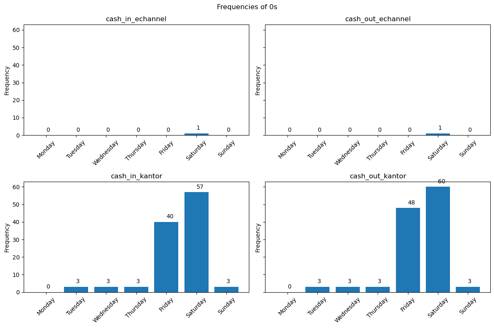
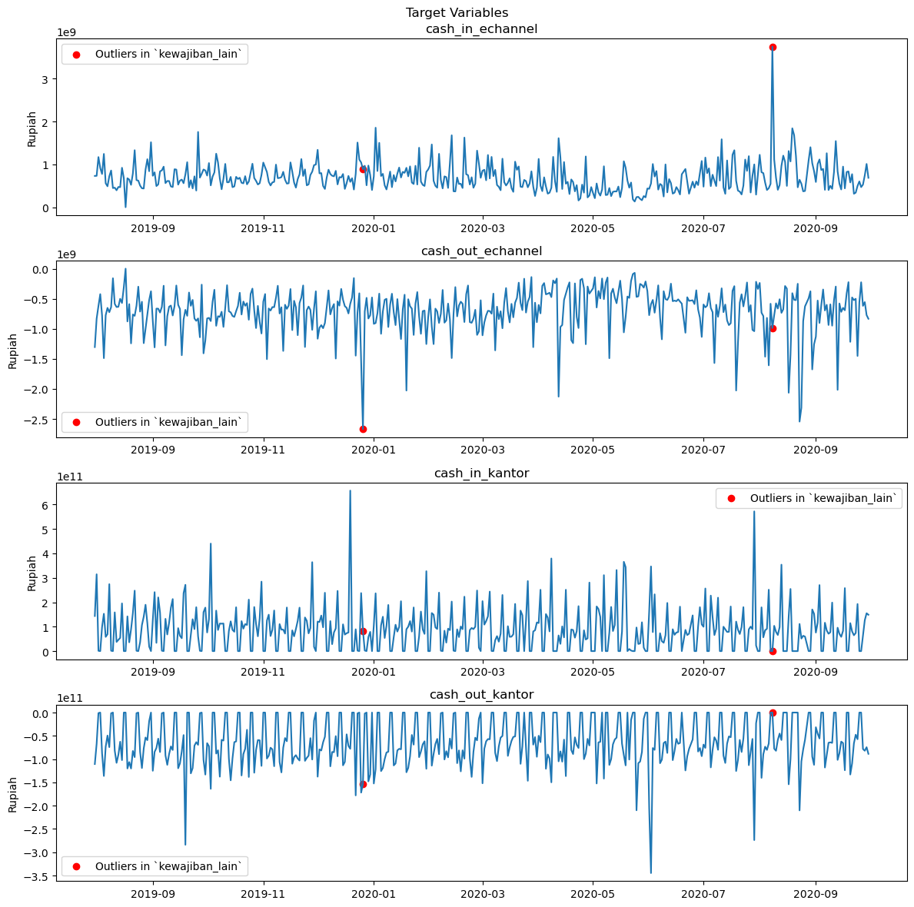
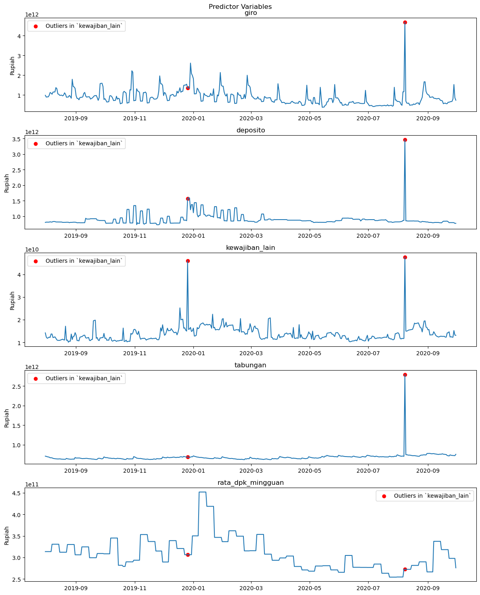
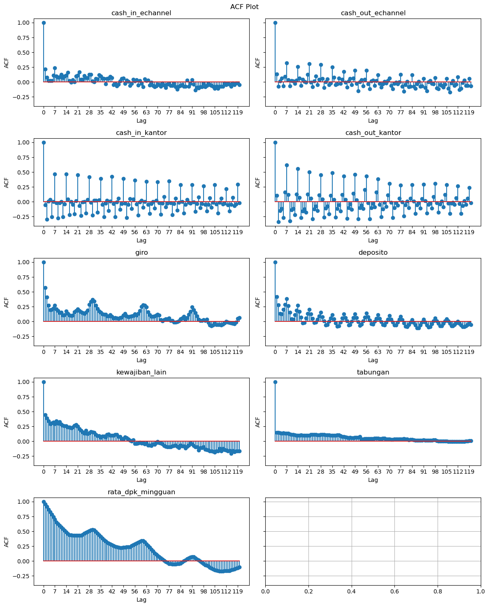
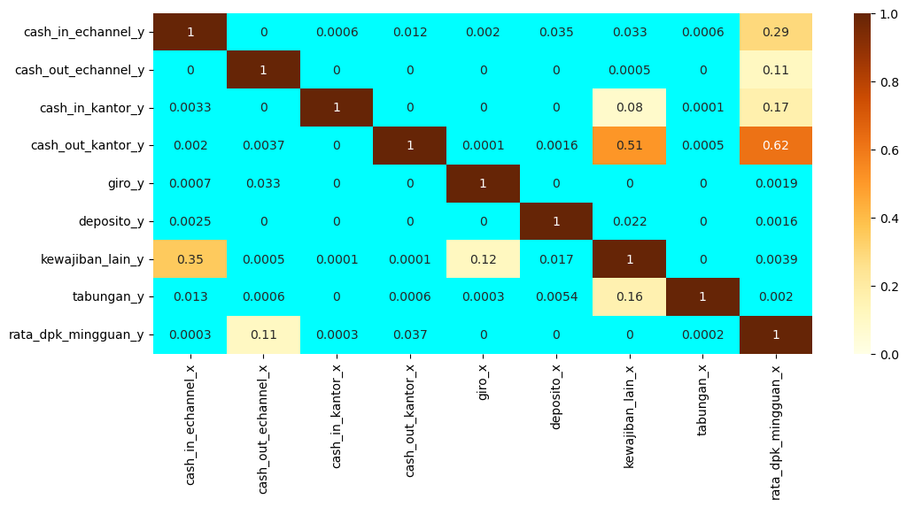
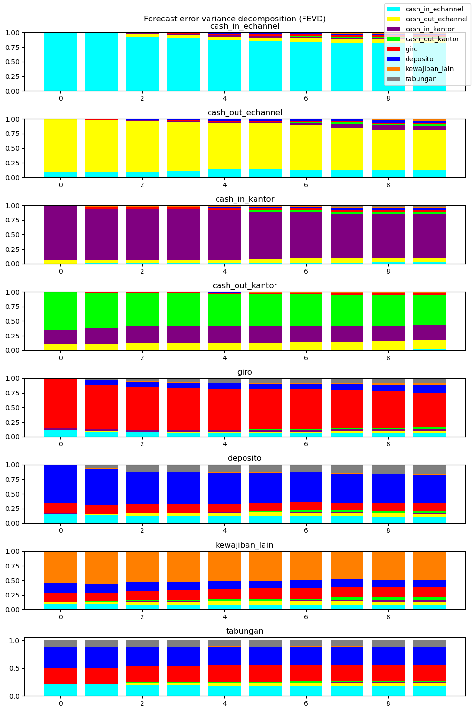
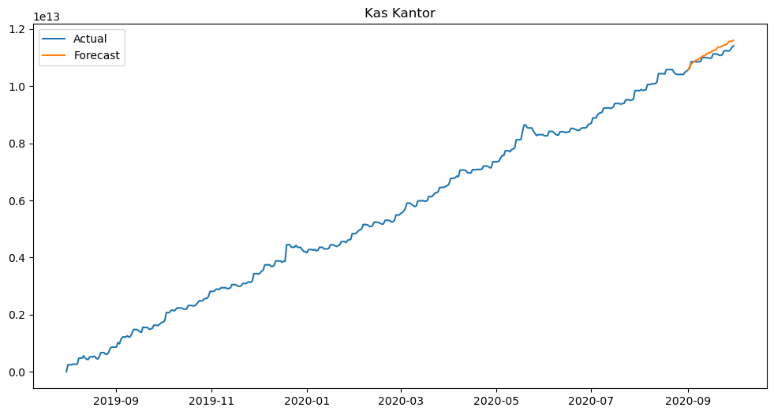
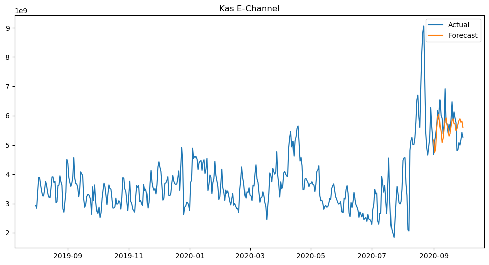
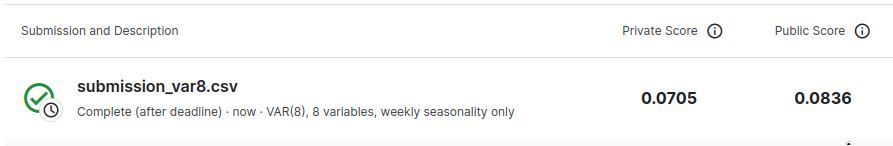
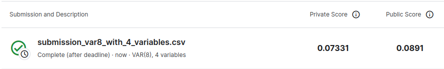

<!-- <h1 align="center">Excel Dashboard</h1> -->
<h1 align="center"><b>BRI Data Hackathon</b></h1><br>

* TOC
{:toc .floating-toc}

## 1. Introduction

Financial institutions use cash ratio to measure their ability to cover its short-term liabilities. A high cash ratio indicates a strong ability to cover liabilities, while a low cash ratio indicates potential difficulties in meeting these obligations. However, an excessively high cash ratio is not ideal because the cash could have been used to seize more opportunities. Therefore, an optimal cash ratio management is crucial to prevent additional expenses or potential losses.

As a state-owned bank, Bank Rakyat Indonesia (BRI) faces similar challenges. In one of [its hackaton](https://www.kaggle.com/competitions/bri-data-hackathon-cr-optimization/), BRI challenged data analysts to develop a machine-learning model for forecasting the cash amounts in its work units, ATMs (Automated Teller Machine), and CRMs (Cash Recycle Machine). Accurate forecasting can lead to better management practices, preventing BRI from incurring additional expenses or losing potential cash usage.

To be more specific, the task is to predict the `kas_kantor` and `kas_echannel` columns for the next 31 days using several variables. Both variables are defined as follows:

$$
kas\_kantor_{t} = kas\_kantor_{t-1} + cash\_in\_kantor_{t} + cash\_out\_kantor_{t} \\
kas\_echannel_{t} = kas\_echannel_{t-1} + cash\_in\_echannel_{t} + cash\_out\_echannel_{t}
$$

where $$t$$ is time. Since `kas_kantor` and `kas_echannel` can be calculated using these formula, essentially, the task is to forecast the four `cash_in` and `cash_out` variables.

## 2. Data Cleaning

First, let's load the data and take a quick look.


```python
import pandas as pd
df = pd.read_csv('../data/raw/train.csv')
df.head()
```


<div>
<style scoped>
    .dataframe tbody tr th:only-of-type {
        vertical-align: middle;
    }

    .dataframe tbody tr th {
        vertical-align: top;
    }

    .dataframe thead th {
        text-align: right;
    }
</style>
<table border="1" class="dataframe">
  <thead>
    <tr style="text-align: right;">
      <th></th>
      <th>periode</th>
      <th>cash_in_echannel</th>
      <th>cash_out_echannel</th>
      <th>cash_in_kantor</th>
      <th>cash_out_kantor</th>
      <th>cr_ketetapan_total_bkn_sum</th>
      <th>giro</th>
      <th>deposito</th>
      <th>kewajiban_lain</th>
      <th>tabungan</th>
      <th>rata_dpk_mingguan</th>
      <th>kas_kantor</th>
      <th>kas_echannel</th>
    </tr>
  </thead>
  <tbody>
    <tr>
      <th>0</th>
      <td>2019-07-31</td>
      <td>7.303000e+08</td>
      <td>-1.304400e+09</td>
      <td>1.436722e+11</td>
      <td>-1.106104e+11</td>
      <td>3.0</td>
      <td>9.867358e+11</td>
      <td>8.048153e+11</td>
      <td>1.419685e+10</td>
      <td>7.072647e+11</td>
      <td>3.135744e+11</td>
      <td>1.928940e+09</td>
      <td>2.939100e+09</td>
    </tr>
    <tr>
      <th>1</th>
      <td>2019-08-01</td>
      <td>7.322000e+08</td>
      <td>-8.321500e+08</td>
      <td>3.144131e+11</td>
      <td>-6.710987e+10</td>
      <td>3.0</td>
      <td>8.962459e+11</td>
      <td>8.125611e+11</td>
      <td>1.234062e+10</td>
      <td>7.011995e+11</td>
      <td>3.135744e+11</td>
      <td>2.492322e+11</td>
      <td>2.839150e+09</td>
    </tr>
    <tr>
      <th>2</th>
      <td>2019-08-02</td>
      <td>1.169800e+09</td>
      <td>-6.214000e+08</td>
      <td>1.251294e+09</td>
      <td>-1.142332e+09</td>
      <td>3.0</td>
      <td>9.059714e+11</td>
      <td>8.127225e+11</td>
      <td>1.182022e+10</td>
      <td>6.922787e+11</td>
      <td>3.135744e+11</td>
      <td>2.493411e+11</td>
      <td>3.387550e+09</td>
    </tr>
    <tr>
      <th>3</th>
      <td>2019-08-03</td>
      <td>9.134500e+08</td>
      <td>-4.240500e+08</td>
      <td>0.000000e+00</td>
      <td>0.000000e+00</td>
      <td>3.0</td>
      <td>9.057127e+11</td>
      <td>8.127253e+11</td>
      <td>1.199640e+10</td>
      <td>6.867224e+11</td>
      <td>3.135744e+11</td>
      <td>2.493411e+11</td>
      <td>3.876950e+09</td>
    </tr>
    <tr>
      <th>4</th>
      <td>2019-08-04</td>
      <td>7.752500e+08</td>
      <td>-7.779500e+08</td>
      <td>9.883331e+10</td>
      <td>-8.729274e+10</td>
      <td>3.0</td>
      <td>9.788347e+11</td>
      <td>8.124711e+11</td>
      <td>1.232962e+10</td>
      <td>6.813438e+11</td>
      <td>3.135744e+11</td>
      <td>2.608817e+11</td>
      <td>3.874250e+09</td>
    </tr>
  </tbody>
</table>
</div>


```python
df.dtypes
```


    periode                        object
    cash_in_echannel              float64
    cash_out_echannel             float64
    cash_in_kantor                float64
    cash_out_kantor               float64
    cr_ketetapan_total_bkn_sum    float64
    giro                          float64
    deposito                      float64
    kewajiban_lain                float64
    tabungan                      float64
    rata_dpk_mingguan             float64
    kas_kantor                    float64
    kas_echannel                  float64
    dtype: object


```python
df.shape
```


    (425, 13)


The train data consists of 425 rows and 13 columns. All columns are float except for `periode` which is supposed to be a datetime format.


```python
df['periode'] = pd.to_datetime(df['periode'])
df.dtypes
```


    periode                       datetime64[ns]
    cash_in_echannel                     float64
    cash_out_echannel                    float64
    cash_in_kantor                       float64
    cash_out_kantor                      float64
    cr_ketetapan_total_bkn_sum           float64
    giro                                 float64
    deposito                             float64
    kewajiban_lain                       float64
    tabungan                             float64
    rata_dpk_mingguan                    float64
    kas_kantor                           float64
    kas_echannel                         float64
    dtype: object


```python
df['periode'].describe()
```


    count                              425
    mean     2020-02-28 13:02:40.941176320
    min                2019-07-31 00:00:00
    25%                2019-11-14 00:00:00
    50%                2020-02-28 00:00:00
    75%                2020-06-13 00:00:00
    max                2020-09-30 00:00:00
    Name: periode, dtype: object


There are 425 unique values in the `periode` column, indicating that there is no duplicated value. Furthermore, there is no missing value in the dataset, as confirmed by the following sum of 0. Similarly, there is no missing values detected from the other float columns.


```python
df.isna().sum()
```


    periode                       0
    cash_in_echannel              0
    cash_out_echannel             0
    cash_in_kantor                0
    cash_out_kantor               0
    cr_ketetapan_total_bkn_sum    0
    giro                          0
    deposito                      0
    kewajiban_lain                0
    tabungan                      0
    rata_dpk_mingguan             0
    kas_kantor                    0
    kas_echannel                  0
    dtype: int64


Meanwhile, the summary of the float columns provides some valuable insight.


```python
df.select_dtypes('float').describe()
```


<div>
<style scoped>
    .dataframe tbody tr th:only-of-type {
        vertical-align: middle;
    }

    .dataframe tbody tr th {
        vertical-align: top;
    }

    .dataframe thead th {
        text-align: right;
    }
</style>
<table border="1" class="dataframe">
  <thead>
    <tr style="text-align: right;">
      <th></th>
      <th>cash_in_echannel</th>
      <th>cash_out_echannel</th>
      <th>cash_in_kantor</th>
      <th>cash_out_kantor</th>
      <th>cr_ketetapan_total_bkn_sum</th>
      <th>giro</th>
      <th>deposito</th>
      <th>kewajiban_lain</th>
      <th>tabungan</th>
      <th>rata_dpk_mingguan</th>
      <th>kas_kantor</th>
      <th>kas_echannel</th>
    </tr>
  </thead>
  <tbody>
    <tr>
      <th>count</th>
      <td>4.250000e+02</td>
      <td>4.250000e+02</td>
      <td>4.250000e+02</td>
      <td>4.250000e+02</td>
      <td>425.0</td>
      <td>4.250000e+02</td>
      <td>4.250000e+02</td>
      <td>4.250000e+02</td>
      <td>4.250000e+02</td>
      <td>4.250000e+02</td>
      <td>4.250000e+02</td>
      <td>4.250000e+02</td>
    </tr>
    <tr>
      <th>mean</th>
      <td>7.033414e+08</td>
      <td>-6.992033e+08</td>
      <td>8.977969e+10</td>
      <td>-6.286235e+10</td>
      <td>3.0</td>
      <td>8.812831e+11</td>
      <td>9.006301e+11</td>
      <td>1.376502e+10</td>
      <td>6.781954e+11</td>
      <td>3.092173e+11</td>
      <td>5.749233e+12</td>
      <td>3.755702e+09</td>
    </tr>
    <tr>
      <th>std</th>
      <td>3.421859e+08</td>
      <td>3.735076e+08</td>
      <td>9.260369e+10</td>
      <td>5.224739e+10</td>
      <td>0.0</td>
      <td>3.866041e+11</td>
      <td>1.915942e+11</td>
      <td>3.401930e+09</td>
      <td>1.093638e+11</td>
      <td>3.761426e+10</td>
      <td>3.252305e+12</td>
      <td>1.024274e+09</td>
    </tr>
    <tr>
      <th>min</th>
      <td>0.000000e+00</td>
      <td>-2.670100e+09</td>
      <td>0.000000e+00</td>
      <td>-3.447494e+11</td>
      <td>3.0</td>
      <td>3.820936e+11</td>
      <td>7.293214e+11</td>
      <td>1.008030e+10</td>
      <td>6.170567e+11</td>
      <td>2.544115e+11</td>
      <td>1.928940e+09</td>
      <td>1.834650e+09</td>
    </tr>
    <tr>
      <th>25%</th>
      <td>4.731000e+08</td>
      <td>-8.321500e+08</td>
      <td>0.000000e+00</td>
      <td>-9.581374e+10</td>
      <td>3.0</td>
      <td>6.132331e+11</td>
      <td>8.071794e+11</td>
      <td>1.172827e+10</td>
      <td>6.432508e+11</td>
      <td>2.801590e+11</td>
      <td>2.992979e+12</td>
      <td>3.093200e+09</td>
    </tr>
    <tr>
      <th>50%</th>
      <td>6.357000e+08</td>
      <td>-6.359000e+08</td>
      <td>7.930647e+10</td>
      <td>-6.712278e+10</td>
      <td>3.0</td>
      <td>8.192550e+11</td>
      <td>8.559837e+11</td>
      <td>1.281586e+10</td>
      <td>6.670075e+11</td>
      <td>3.061373e+11</td>
      <td>5.488568e+12</td>
      <td>3.533750e+09</td>
    </tr>
    <tr>
      <th>75%</th>
      <td>8.567000e+08</td>
      <td>-4.792500e+08</td>
      <td>1.264345e+11</td>
      <td>0.000000e+00</td>
      <td>3.0</td>
      <td>1.027486e+12</td>
      <td>9.102288e+11</td>
      <td>1.521910e+10</td>
      <td>6.962898e+11</td>
      <td>3.306770e+11</td>
      <td>8.453749e+12</td>
      <td>4.087700e+09</td>
    </tr>
    <tr>
      <th>max</th>
      <td>3.744400e+09</td>
      <td>0.000000e+00</td>
      <td>6.569255e+11</td>
      <td>0.000000e+00</td>
      <td>3.0</td>
      <td>4.678342e+12</td>
      <td>3.464395e+12</td>
      <td>4.759059e+10</td>
      <td>2.794601e+12</td>
      <td>4.516209e+11</td>
      <td>1.140874e+13</td>
      <td>9.070650e+09</td>
    </tr>
  </tbody>
</table>
</div>


First, the `cr_ketetapan_total_bkn_sum`, representing the maximum cash ratio set by the headquarters, appears to be a constant variable. Since the variable is unlikely to contribute to the predictive model, this variable will be dropped.


```python
df = df.drop('cr_ketetapan_total_bkn_sum', axis=1)
df.dtypes
```


    periode              datetime64[ns]
    cash_in_echannel            float64
    cash_out_echannel           float64
    cash_in_kantor              float64
    cash_out_kantor             float64
    giro                        float64
    deposito                    float64
    kewajiban_lain              float64
    tabungan                    float64
    rata_dpk_mingguan           float64
    kas_kantor                  float64
    kas_echannel                float64
    dtype: object


Second, the minimum values of `cash_in_echannel` and `cash_in_kantor` is 0, while the maximum values of `cash_out_echannel` and `cash_out_kantor` is 0. It means that there is at least a day without any transaction, neither `cash_in` nor `cash_out`, neither through `e-channel` (ATM and CRM) nor work unit (`kantor`). 

It is essential to determine whether these 0 values are indicative of previously undetected missing values.


```python
def df_with0(variable_name):
    days = ['Monday', 'Tuesday', 'Wednesday', 'Thursday', 'Friday', 'Saturday', 'Sunday']
    temp1 = pd.DataFrame({'day': days, 'variable': variable_name})

    temp2 = df.loc[df[variable_name]==0]
    temp2 = temp2[['periode', variable_name]]
    temp2['day'] = temp2['periode'].dt.day_name()
    temp2 = temp2.drop('periode', axis = 1)
    temp2 = pd.melt(temp2, id_vars = 'day').groupby(['day', 'variable']).size().reset_index(name = 'count')
    res = pd.merge(temp1, temp2, how = 'left', on = ['day', 'variable']).fillna(0)
    res['count'] = res['count'].astype(int)
    return(res)

df_with0_cie = df_with0('cash_in_echannel')
df_with0_coe = df_with0('cash_out_echannel')
df_with0_cik = df_with0('cash_in_kantor')
df_with0_cok = df_with0('cash_out_kantor')
```


```python
import matplotlib.pyplot as plt

subplots_data = [
    ('cash_in_echannel', df_with0_cie),
    ('cash_out_echannel', df_with0_coe),
    ('cash_in_kantor', df_with0_cik),
    ('cash_out_kantor', df_with0_cok)
]

fig, ax = plt.subplots(2, 2, figsize=(12, 8), sharey=True)

for i, (title, df0) in enumerate(subplots_data):
    ax[i // 2, i % 2].bar(df0['day'], df0['count'])
    ax[i // 2, i % 2].set_title(title)
    ax[i // 2, i % 2].tick_params(axis='x', rotation=45)
    ax[i // 2, i % 2].set_ylabel('Frequency')
    
    for x, count in enumerate(df0['count']):
        ax[i // 2, i % 2].text(x, count + 2, str(count))

fig.suptitle('Frequencies of 0s')
plt.tight_layout()
plt.show()
```


    

    


Based on the bar plot, there is only one case where either `cash_in_echannel` or `cash_out_echannel` has a 0 value.


```python
df[(df['cash_in_echannel'] == 0) | (df['cash_out_echannel'] == 0)]
```


<div>
<style scoped>
    .dataframe tbody tr th:only-of-type {
        vertical-align: middle;
    }

    .dataframe tbody tr th {
        vertical-align: top;
    }

    .dataframe thead th {
        text-align: right;
    }
</style>
<table border="1" class="dataframe">
  <thead>
    <tr style="text-align: right;">
      <th></th>
      <th>periode</th>
      <th>cash_in_echannel</th>
      <th>cash_out_echannel</th>
      <th>cash_in_kantor</th>
      <th>cash_out_kantor</th>
      <th>giro</th>
      <th>deposito</th>
      <th>kewajiban_lain</th>
      <th>tabungan</th>
      <th>rata_dpk_mingguan</th>
      <th>kas_kantor</th>
      <th>kas_echannel</th>
    </tr>
  </thead>
  <tbody>
    <tr>
      <th>17</th>
      <td>2019-08-17</td>
      <td>0.0</td>
      <td>0.0</td>
      <td>0.0</td>
      <td>0.0</td>
      <td>9.937675e+11</td>
      <td>8.162532e+11</td>
      <td>1.122372e+10</td>
      <td>6.297599e+11</td>
      <td>3.121542e+11</td>
      <td>5.278389e+11</td>
      <td>3.902150e+09</td>
    </tr>
  </tbody>
</table>
</div>


On August 17th, which falls on a Saturday and also marks Indonesia's Independence Day, all four columns register 0s. Although this may raise doubts, considering that this is a singular case and that the other columns do not contain 0s, it is reasonable to assume that these 0s are coincidental.

Conversely, based on the bar plot, there are numerous instances where `cash_in_kantor` or `cash_out_kantor` is 0. Most of these occurrences are on Fridays or Saturdays, which may be typical given the likely slowdown in transactions during weekends. However, there are also some 0s during weekdays.


```python
df_day = df.copy(deep = True)
df_day['day'] = df['periode'].dt.day_name()
df_day[((df_day['cash_in_kantor'] == 0) | (df_day['cash_out_kantor'] == 0)) & (~df_day['day'].isin(['Friday', 'Saturday']))]
```


<div>
<style scoped>
    .dataframe tbody tr th:only-of-type {
        vertical-align: middle;
    }

    .dataframe tbody tr th {
        vertical-align: top;
    }

    .dataframe thead th {
        text-align: right;
    }
</style>
<table border="1" class="dataframe">
  <thead>
    <tr style="text-align: right;">
      <th></th>
      <th>periode</th>
      <th>cash_in_echannel</th>
      <th>cash_out_echannel</th>
      <th>cash_in_kantor</th>
      <th>cash_out_kantor</th>
      <th>giro</th>
      <th>deposito</th>
      <th>kewajiban_lain</th>
      <th>tabungan</th>
      <th>rata_dpk_mingguan</th>
      <th>kas_kantor</th>
      <th>kas_echannel</th>
      <th>day</th>
    </tr>
  </thead>
  <tbody>
    <tr>
      <th>146</th>
      <td>2019-12-24</td>
      <td>1.111500e+09</td>
      <td>-409800000.0</td>
      <td>0.0</td>
      <td>0.0</td>
      <td>1.505556e+12</td>
      <td>8.748787e+11</td>
      <td>1.540411e+10</td>
      <td>6.881699e+11</td>
      <td>3.063129e+11</td>
      <td>4.361746e+12</td>
      <td>4.917000e+09</td>
      <td>Tuesday</td>
    </tr>
    <tr>
      <th>153</th>
      <td>2019-12-31</td>
      <td>4.021000e+08</td>
      <td>-479500000.0</td>
      <td>0.0</td>
      <td>0.0</td>
      <td>1.982458e+12</td>
      <td>1.379160e+12</td>
      <td>1.509071e+10</td>
      <td>6.900472e+11</td>
      <td>3.500410e+11</td>
      <td>4.212213e+12</td>
      <td>2.949150e+09</td>
      <td>Tuesday</td>
    </tr>
    <tr>
      <th>237</th>
      <td>2020-03-24</td>
      <td>6.372000e+08</td>
      <td>-167650000.0</td>
      <td>0.0</td>
      <td>0.0</td>
      <td>6.654718e+11</td>
      <td>8.826424e+11</td>
      <td>1.139629e+10</td>
      <td>6.412735e+11</td>
      <td>2.934875e+11</td>
      <td>6.263132e+12</td>
      <td>4.200000e+09</td>
      <td>Tuesday</td>
    </tr>
    <tr>
      <th>253</th>
      <td>2020-04-09</td>
      <td>1.174350e+09</td>
      <td>-195550000.0</td>
      <td>0.0</td>
      <td>0.0</td>
      <td>5.772622e+11</td>
      <td>8.749256e+11</td>
      <td>1.374268e+10</td>
      <td>6.753326e+11</td>
      <td>3.033082e+11</td>
      <td>7.061063e+12</td>
      <td>4.890550e+09</td>
      <td>Thursday</td>
    </tr>
    <tr>
      <th>274</th>
      <td>2020-04-30</td>
      <td>4.695000e+08</td>
      <td>-370300000.0</td>
      <td>0.0</td>
      <td>0.0</td>
      <td>7.327576e+11</td>
      <td>8.598572e+11</td>
      <td>1.463493e+10</td>
      <td>6.926115e+11</td>
      <td>2.682446e+11</td>
      <td>7.352369e+12</td>
      <td>3.664550e+09</td>
      <td>Thursday</td>
    </tr>
    <tr>
      <th>280</th>
      <td>2020-05-06</td>
      <td>4.110000e+08</td>
      <td>-164200000.0</td>
      <td>0.0</td>
      <td>0.0</td>
      <td>8.732897e+11</td>
      <td>8.026630e+11</td>
      <td>1.136009e+10</td>
      <td>6.581450e+11</td>
      <td>2.682446e+11</td>
      <td>7.568471e+12</td>
      <td>3.643150e+09</td>
      <td>Wednesday</td>
    </tr>
    <tr>
      <th>294</th>
      <td>2020-05-20</td>
      <td>6.201500e+08</td>
      <td>-463600000.0</td>
      <td>0.0</td>
      <td>0.0</td>
      <td>6.610497e+11</td>
      <td>8.275301e+11</td>
      <td>1.413634e+10</td>
      <td>7.159176e+11</td>
      <td>2.809458e+11</td>
      <td>8.639736e+12</td>
      <td>3.162800e+09</td>
      <td>Wednesday</td>
    </tr>
    <tr>
      <th>298</th>
      <td>2020-05-24</td>
      <td>1.330500e+08</td>
      <td>-69700000.0</td>
      <td>0.0</td>
      <td>0.0</td>
      <td>8.198881e+11</td>
      <td>8.282270e+11</td>
      <td>1.367334e+10</td>
      <td>7.016690e+11</td>
      <td>2.711700e+11</td>
      <td>8.533828e+12</td>
      <td>3.661300e+09</td>
      <td>Sunday</td>
    </tr>
    <tr>
      <th>305</th>
      <td>2020-05-31</td>
      <td>4.368500e+08</td>
      <td>-374200000.0</td>
      <td>0.0</td>
      <td>0.0</td>
      <td>7.907859e+11</td>
      <td>8.610298e+11</td>
      <td>1.373034e+10</td>
      <td>7.278349e+11</td>
      <td>2.656034e+11</td>
      <td>8.301464e+12</td>
      <td>3.063900e+09</td>
      <td>Sunday</td>
    </tr>
    <tr>
      <th>380</th>
      <td>2020-08-16</td>
      <td>4.972500e+08</td>
      <td>-333400000.0</td>
      <td>0.0</td>
      <td>0.0</td>
      <td>4.985943e+11</td>
      <td>8.500275e+11</td>
      <td>1.577002e+10</td>
      <td>7.187451e+11</td>
      <td>2.815826e+11</td>
      <td>1.043432e+13</td>
      <td>6.704050e+09</td>
      <td>Sunday</td>
    </tr>
    <tr>
      <th>383</th>
      <td>2020-08-19</td>
      <td>1.840500e+09</td>
      <td>-408100000.0</td>
      <td>0.0</td>
      <td>0.0</td>
      <td>5.398479e+11</td>
      <td>8.482722e+11</td>
      <td>1.823588e+10</td>
      <td>7.158342e+11</td>
      <td>2.815826e+11</td>
      <td>1.057593e+13</td>
      <td>7.019300e+09</td>
      <td>Wednesday</td>
    </tr>
    <tr>
      <th>384</th>
      <td>2020-08-20</td>
      <td>1.682300e+09</td>
      <td>-518250000.0</td>
      <td>0.0</td>
      <td>0.0</td>
      <td>5.897436e+11</td>
      <td>8.482493e+11</td>
      <td>1.836587e+10</td>
      <td>7.120740e+11</td>
      <td>2.815826e+11</td>
      <td>1.057593e+13</td>
      <td>8.183350e+09</td>
      <td>Thursday</td>
    </tr>
  </tbody>
</table>
</div>


However, all of these 0s were on holiday or between holidays:
- 2019-12-24: Christmas
- 2019-12-31: New year
- 2020-03-24: Not a holiday, but it is between weekend and Nyepi (2020-03-25)
- 2020-04-09: Easter day
- 2020-04-30: Labor day (on the following day)
- 2020-05-06: Waisak
- 2020-05-20: Ascension (Isa Al-Masih) day
- 2020-05-24: Eid Al-Fitr
- 2020-05-31: Eid Al-Fitr / Pancasila day (on the following day)
- 2020-08-16: Indonesia's Independence day (on the following day)
- 2020-08-19: Islamic new year
- 2020-08-20: Islamic new year

Hence, it can be confidently concluded that the 0s in the dataset are not a result of missing values.

## 3. Exploratory Data Analysis

### 3.1. Line Plot

Time series data often have unique characteristics such as trends and seasonality. Therefore, it is crucial to evaluate the line plots of the variables.


```python
cash_in_out = df[['periode', 'cash_in_echannel',
                  'cash_out_echannel', 'cash_in_kantor', 'cash_out_kantor']]
fig, ax = plt.subplots(figsize=(12, 12), nrows = 4, ncols = 1)
for row_idx in range(0, 4):
    ax[row_idx].plot(cash_in_out['periode'], cash_in_out.iloc[:, row_idx + 1])
    ax[row_idx].scatter(cash_in_out['periode'][[148, 372]], cash_in_out.iloc[[148, 372], row_idx + 1], color = 'red', label = 'Outliers in `kewajiban_lain`')
    ax[row_idx].set_title(cash_in_out.columns[row_idx + 1])
    ax[row_idx].tick_params(axis = 'x')
    ax[row_idx].set_ylabel('Rupiah')
    ax[row_idx].legend()
plt.suptitle('Target Variables')
plt.tight_layout()
plt.show()
```


    

    


The target variables seems to be stationary in mean, but not in variance. There are some outliers that may increase forecast accuracy if dealt with. Additionally, there are noticeable repeating patterns which may indicate seasonality.


```python
cash_in_out = df[['periode', 'giro', 'deposito', 'kewajiban_lain', 'tabungan', 'rata_dpk_mingguan']]
fig, ax = plt.subplots(figsize=(12, 15), nrows = 5, ncols = 1)
for row_idx in range(0, 5):
    ax[row_idx].plot(cash_in_out['periode'], cash_in_out.iloc[:, row_idx + 1])
    ax[row_idx].scatter(cash_in_out['periode'][[148,372]], cash_in_out.iloc[[148,372], row_idx + 1], color = 'red', label = 'Outliers in `kewajiban_lain`')
    ax[row_idx].set_title(cash_in_out.columns[row_idx + 1])
    ax[row_idx].tick_params(axis = 'x')
    ax[row_idx].set_ylabel('Rupiah')
    ax[row_idx].legend()
plt.suptitle('Predictor Variables')
plt.tight_layout()
plt.show()
```


    

    


One of the most prominent feature of the predictor variables is the presence of outliers. There is also a monthly seasonality in `giro` and a slight monthly seasonality in `rata_dpk_mingguan`. However, it is essential to conduct further checks to confirm the seasonality.

### 3.2. Outliers

It is important to determine whether the outliers were caused by errors or just unusual events. If the outliers were caused by errors, the outliers have to be re-estimated because the outliers can introduce bias to a forecasting model.

From the line plots, there are two most noticeable outliers in `kewajiban_lain`. These outliers are represented as red dots in the previous line plots.


```python
import numpy as np

def detect_outliers(series):
    q1 = np.percentile(series, 25)
    q3 = np.percentile(series, 75)
    iqr = q3 - q1
    
    lower_bound = q1 - 1.5 * iqr
    upper_bound = q3 + 1.5 * iqr

    outlier_indices = []
    for idx in series.index:
        if (series[idx] < lower_bound) | (series[idx] > upper_bound):
            outlier_indices.append(idx)
    return outlier_indices

outlier_idx = detect_outliers(df['kewajiban_lain'])
outlier_idx
```


    [140, 148, 174, 185, 203, 233, 234, 372]


```python
df.loc[outlier_idx, ['periode', 'kewajiban_lain']]
```


<div>
<style scoped>
    .dataframe tbody tr th:only-of-type {
        vertical-align: middle;
    }

    .dataframe tbody tr th {
        vertical-align: top;
    }

    .dataframe thead th {
        text-align: right;
    }
</style>
<table border="1" class="dataframe">
  <thead>
    <tr style="text-align: right;">
      <th></th>
      <th>periode</th>
      <th>kewajiban_lain</th>
    </tr>
  </thead>
  <tbody>
    <tr>
      <th>140</th>
      <td>2019-12-18</td>
      <td>2.520271e+10</td>
    </tr>
    <tr>
      <th>148</th>
      <td>2019-12-26</td>
      <td>4.594439e+10</td>
    </tr>
    <tr>
      <th>174</th>
      <td>2020-01-21</td>
      <td>2.241007e+10</td>
    </tr>
    <tr>
      <th>185</th>
      <td>2020-02-01</td>
      <td>2.048519e+10</td>
    </tr>
    <tr>
      <th>203</th>
      <td>2020-02-19</td>
      <td>2.049487e+10</td>
    </tr>
    <tr>
      <th>233</th>
      <td>2020-03-20</td>
      <td>2.064216e+10</td>
    </tr>
    <tr>
      <th>234</th>
      <td>2020-03-21</td>
      <td>2.079752e+10</td>
    </tr>
    <tr>
      <th>372</th>
      <td>2020-08-08</td>
      <td>4.759059e+10</td>
    </tr>
  </tbody>
</table>
</div>


The first noticeable outlier occurred on 2019-12-26. Notably, no other variable exhibited such extreme values on that date. While this event is improbable, it is not impossible. Furthermore, the outlier's magnitude was not exceptionally high, being approximately two times the values of 'kewajiban_lain' a few days before and after 2019-12-26. Therefore, it can be reasonably assumed that the outlier on 2019-12-26 in 'kewajiban_lain' is not an error.

On the other hand, the second outlier, observed on 2020-08-08, affected four different predictor variables: `giro`, `deposito`, `kewajiban_lain`, and `tabungan`. Although these outliers appear significantly higher than the other values, they are, in fact, only three to four times higher than the third quartile (Q3).


```python
for variable in ['giro', 'deposito', 'kewajiban_lain', 'tabungan']:
    print(f'{variable} max value is {df[variable].max() / np.percentile(df[variable], 75): .1f} times the Q3.')
```

    giro max value is  4.6 times the Q3.
    deposito max value is  3.8 times the Q3.
    kewajiban_lain max value is  3.1 times the Q3.
    tabungan max value is  4.0 times the Q3.


Moreover, on the same day, the highest `cash_in_echannel` value is recorded, which might contribute to these outliers. Considering that these data were likely recorded automatically, it can be confidently assumed that the outliers are not the result of typing errors.

In summary, although the outliers may seem suspicious, they are unlikely to be errors but rather unusual events. Nonetheless, a more thorough analysis would be preferable if additional data were available.

### 3.3. Seasonality

The previous line plots provide some indications regarding the stationarity of the data. To statistically assess stationarity, an Augmented Dickey Fuller (ADF) test will be conducted.


```python
from statsmodels.tsa.stattools import adfuller

def adf_test(data, variable_name, sig_level = 0.05):
    p_value = adfuller(data[variable_name])[1]
    if p_value < sig_level:
        print(f'{variable_name} is stationary with ADF p-value of {p_value: .2f}.')
    else:
        print(f'>>>   {variable_name} is NOT stationary with ADF p-value of {p_value: .2f}.   <<<')

for column in df.select_dtypes('float').columns[:-2]:
    adf_test(df, column)
```

    cash_in_echannel is stationary with ADF p-value of  0.00.
    cash_out_echannel is stationary with ADF p-value of  0.00.
    cash_in_kantor is stationary with ADF p-value of  0.00.
    cash_out_kantor is stationary with ADF p-value of  0.00.
    giro is stationary with ADF p-value of  0.00.
    deposito is stationary with ADF p-value of  0.00.
    kewajiban_lain is stationary with ADF p-value of  0.04.
    tabungan is stationary with ADF p-value of  0.00.
    >>>   rata_dpk_mingguan is NOT stationary with ADF p-value of  0.27.   <<<


Based on the ADF test, all variables are stationary except for `rata_dpk_mingguan`. However, it is important to note that there are also indications of seasonality in the line plots, which can sometimes lead the ADF test to classify a variable as stationary when it is not due to the presence of seasonal patterns.


```python
import statsmodels.api as sm
variable_names = df.select_dtypes("float64").columns[:-2]
nlag = 120
df_acf = pd.DataFrame()
for column in variable_names:
    df_acf[column] = sm.tsa.acf(df[column], nlags=nlag)

fig, ax = plt.subplots(5, 2, sharey = True, figsize = (12,15))
for i, column in enumerate(variable_names):
    ax[i // 2, i % 2].stem(df_acf[column])
    ax[i // 2, i % 2].set_xlabel('Lag')
    ax[i // 2, i % 2].set_ylabel('ACF')
    ax[i // 2, i % 2].set_title(column)
    ax[i // 2, i % 2].set_xticks(range(0, nlag, 7))

fig.suptitle('ACF Plot')
plt.tight_layout()
plt.grid(True)
```


    

    


Examining the Autocorrelation Function (ACF) plot reveals further insights. `cash_in_echannel`, `kewajiban_lain`, and `tabungan` do not have seasonality, while `rata_dpk_mingguan` displays monthly seasonality. `giro` demonstrates both weekly and monthly seasonality, and the remaining variables display weekly seasonality.

This ACF analysis suggests that, contrary to the ADF results, only `cash_in_echannel`, `kewajiban_lain`, and `tabungan` are genuinely stationary. To address the seasonality present in some variables, dummy variables will be introduced into the dataset.


```python
from statsmodels.tsa.deterministic import Seasonality
weekly_dummy = Seasonality(7).in_sample(df.index)
# monthly_dummy = Seasonality(30).in_sample(df.index)
# df_dummy = monthly_dummy.join(weekly_dummy, on = df.index, how = 'left')
df_dummy = weekly_dummy.copy(deep = True)
df_dummy
```


<div>
<style scoped>
    .dataframe tbody tr th:only-of-type {
        vertical-align: middle;
    }

    .dataframe tbody tr th {
        vertical-align: top;
    }

    .dataframe thead th {
        text-align: right;
    }
</style>
<table border="1" class="dataframe">
  <thead>
    <tr style="text-align: right;">
      <th></th>
      <th>s(1,7)</th>
      <th>s(2,7)</th>
      <th>s(3,7)</th>
      <th>s(4,7)</th>
      <th>s(5,7)</th>
      <th>s(6,7)</th>
      <th>s(7,7)</th>
    </tr>
  </thead>
  <tbody>
    <tr>
      <th>0</th>
      <td>1.0</td>
      <td>0.0</td>
      <td>0.0</td>
      <td>0.0</td>
      <td>0.0</td>
      <td>0.0</td>
      <td>0.0</td>
    </tr>
    <tr>
      <th>1</th>
      <td>0.0</td>
      <td>1.0</td>
      <td>0.0</td>
      <td>0.0</td>
      <td>0.0</td>
      <td>0.0</td>
      <td>0.0</td>
    </tr>
    <tr>
      <th>2</th>
      <td>0.0</td>
      <td>0.0</td>
      <td>1.0</td>
      <td>0.0</td>
      <td>0.0</td>
      <td>0.0</td>
      <td>0.0</td>
    </tr>
    <tr>
      <th>3</th>
      <td>0.0</td>
      <td>0.0</td>
      <td>0.0</td>
      <td>1.0</td>
      <td>0.0</td>
      <td>0.0</td>
      <td>0.0</td>
    </tr>
    <tr>
      <th>4</th>
      <td>0.0</td>
      <td>0.0</td>
      <td>0.0</td>
      <td>0.0</td>
      <td>1.0</td>
      <td>0.0</td>
      <td>0.0</td>
    </tr>
    <tr>
      <th>...</th>
      <td>...</td>
      <td>...</td>
      <td>...</td>
      <td>...</td>
      <td>...</td>
      <td>...</td>
      <td>...</td>
    </tr>
    <tr>
      <th>420</th>
      <td>1.0</td>
      <td>0.0</td>
      <td>0.0</td>
      <td>0.0</td>
      <td>0.0</td>
      <td>0.0</td>
      <td>0.0</td>
    </tr>
    <tr>
      <th>421</th>
      <td>0.0</td>
      <td>1.0</td>
      <td>0.0</td>
      <td>0.0</td>
      <td>0.0</td>
      <td>0.0</td>
      <td>0.0</td>
    </tr>
    <tr>
      <th>422</th>
      <td>0.0</td>
      <td>0.0</td>
      <td>1.0</td>
      <td>0.0</td>
      <td>0.0</td>
      <td>0.0</td>
      <td>0.0</td>
    </tr>
    <tr>
      <th>423</th>
      <td>0.0</td>
      <td>0.0</td>
      <td>0.0</td>
      <td>1.0</td>
      <td>0.0</td>
      <td>0.0</td>
      <td>0.0</td>
    </tr>
    <tr>
      <th>424</th>
      <td>0.0</td>
      <td>0.0</td>
      <td>0.0</td>
      <td>0.0</td>
      <td>1.0</td>
      <td>0.0</td>
      <td>0.0</td>
    </tr>
  </tbody>
</table>
<p>425 rows × 7 columns</p>
</div>


### 3.4. Causality Test

Causality test is used to quantify whether past values of one variable can be used to forecast another variable. While a causality test does not establish the true causal relationship between variables, it can serve as a useful indicator for selecting predictor variables. In this context, it's crucial to assess how various variables impact the prediction of the four `cash_in` and `cash_out` variables.

The following presents the results of a Granger causality test.


```python
from statsmodels.tsa.stattools import grangercausalitytests

def grangers_pvalue_matrix(data, variable, maxlag, test = 'ssr_chi2test'):
    import warnings
    warnings.filterwarnings("ignore") # grangercausalitytests output is too much, verbose is deprecated

    p_values_matrix = pd.DataFrame(np.zeros((len(variable), len(variable))), columns=variable, index=variable)
    for c in p_values_matrix.columns: # columns = predictors
        for r in p_values_matrix.index: # rows = response
            test_result = grangercausalitytests(data[[r, c]], maxlag=maxlag, verbose = False)
            p_values = [round(test_result[i+1][0][test][1], 4) for i in range(maxlag)]
            min_p_value = np.min(p_values)
            p_values_matrix.loc[r, c] = min_p_value
    p_values_matrix.columns = [var + '_x' for var in variable]
    p_values_matrix.index = [var + '_y' for var in variable]
    return p_values_matrix

granger_matrix = grangers_pvalue_matrix(df.iloc[:,1:10], df.iloc[:,1:10].columns, maxlag=31)
```


```python
import seaborn as sns
import matplotlib.pyplot as plt

plt.figure(figsize=(12, 5))
mask = granger_matrix < 0.05
sns.heatmap(granger_matrix, annot=True, vmin=0, vmax=1, cmap="YlOrBr")
sns.heatmap(mask, cbar=False, cmap='cool', annot=False, mask=~mask)
```


    <Axes: >


    

    


The x axis shows the predictor variables and y axis shows the target variables. Each cell represents the p-value for a pair of variables. The diagonal consists of 1s, indicating that past values of a variable are not significantly beneficial for forecasting that same variable, as it's paired with itself. The cyan-colored cells represent pairs with p-values less than the significance level of 0.05, indicating statistically significant evidence that past values of the predictor (X) variables can enhance the forecast accuracy of the target (Y) variables.

Focusing on the first four rows, `rata_dpk_mingguan` is the only variables that is not statistically significant. This suggests that including `rata_dpk_mingguan` may not help much in forecasting the `cash_in` and `cash_out` variables. Therefore, the `rata_dpk_mingguan` will be excluded from the model.


```python
df = df.drop('rata_dpk_mingguan', axis = 1)
df.dtypes
```


    periode              datetime64[ns]
    cash_in_echannel            float64
    cash_out_echannel           float64
    cash_in_kantor              float64
    cash_out_kantor             float64
    giro                        float64
    deposito                    float64
    kewajiban_lain              float64
    tabungan                    float64
    kas_kantor                  float64
    kas_echannel                float64
    dtype: object


## 4. Modeling

Based on the Granger causality test, it is evident that the variables are interrelated. In such a situation, Vector Autoregression (VAR) model may be a suitable model to use. 

VAR is a statistical model designed for multivariate time series data with interrelated variables. This is because VAR model uses, not only past values of a target variable, but also past values from another variables to forecast. In this case, this can be beneficial given the interrelated nature of the variables.

VAR is mathematically defined as:

$$
Y_t = c + A_1Y_{t-1} + A_2Y_{t-2} + \ldots + A_pY_{t-p} + \varepsilon_t
$$

where $$Y_t$$ is a vector of time series variables at time $$t$$, $$c$$ is a vector of intercepts, $$A_i$$ are coefficients matrices of each lag, and $$\varepsilon_t$$ is the error vector. $$p$$ is the optimal lag order, therefore, it is important to choose the optimal lag order $$p$$.

### 4.1. Data Splitting

Before selecting the optimal lag order $$p$$, the data will be split into train and test data where the test data has 30 observations. The train data will excludes the `kas_kantor` and `kas_echannel` variables since both variables can be calculated from the four `cash_in` and `cash_out` variables. Instead of predicting `kas_kantor` and `kas_echannel`, the model will be fitted to estimate the four `cash_in` and `cash_out` variables.


```python
df_train, df_test = df.iloc[0:395, 0:9], df.iloc[395:, :]
print(df.shape)
print(df_train.shape)
print(df_test.shape)
```

    (425, 11)
    (395, 9)
    (30, 11)


The dummy variables have to be split as well.


```python
df_train_dummy, df_test_dummy = df_dummy.iloc[0:395, :], df_dummy.iloc[395:, :]
print(df_dummy.shape)
print(df_train_dummy.shape)
print(df_test_dummy.shape)
```

    (425, 7)
    (395, 7)
    (30, 7)


### 4.2. Best Order (p)

The following steps will fit the training data to VAR models with various lag orders $$p$$. The best model will be chosen based on criteria such as AIC, BIC, FPE, and HQIC values


```python
from statsmodels.tsa.api import VAR

model = VAR(df_train.iloc[:, 1:9], exog = df_train_dummy)
best_p = model.select_order(15)
best_p.summary()
```


<table class="simpletable">
<caption>VAR Order Selection (* highlights the minimums)</caption>
<tr>
   <td></td>      <th>AIC</th>         <th>BIC</th>         <th>FPE</th>        <th>HQIC</th>    
</tr>
<tr>
  <th>0</th>  <td>     376.0</td>  <td>     376.6</td>  <td>1.917e+163</td>  <td>     376.2</td> 
</tr>
<tr>
  <th>1</th>  <td>     373.5</td>  <td>     374.8*</td> <td>1.598e+162</td>  <td>     374.0*</td>
</tr>
<tr>
  <th>2</th>  <td>     373.4</td>  <td>     375.4</td>  <td>1.525e+162</td>  <td>     374.2</td> 
</tr>
<tr>
  <th>3</th>  <td>     373.5</td>  <td>     376.1</td>  <td>1.567e+162</td>  <td>     374.5</td> 
</tr>
<tr>
  <th>4</th>  <td>     373.5</td>  <td>     376.8</td>  <td>1.598e+162</td>  <td>     374.8</td> 
</tr>
<tr>
  <th>5</th>  <td>     373.3</td>  <td>     377.3</td>  <td>1.364e+162</td>  <td>     374.9</td> 
</tr>
<tr>
  <th>6</th>  <td>     373.4</td>  <td>     378.0</td>  <td>1.496e+162</td>  <td>     375.2</td> 
</tr>
<tr>
  <th>7</th>  <td>     373.2</td>  <td>     378.5</td>  <td>1.248e+162</td>  <td>     375.3</td> 
</tr>
<tr>
  <th>8</th>  <td>     373.0*</td> <td>     379.0</td>  <td>1.023e+162*</td> <td>     375.4</td> 
</tr>
<tr>
  <th>9</th>  <td>     373.1</td>  <td>     379.8</td>  <td>1.159e+162</td>  <td>     375.7</td> 
</tr>
<tr>
  <th>10</th> <td>     373.1</td>  <td>     380.4</td>  <td>1.152e+162</td>  <td>     376.0</td> 
</tr>
<tr>
  <th>11</th> <td>     373.1</td>  <td>     381.0</td>  <td>1.141e+162</td>  <td>     376.2</td> 
</tr>
<tr>
  <th>12</th> <td>     373.1</td>  <td>     381.7</td>  <td>1.242e+162</td>  <td>     376.5</td> 
</tr>
<tr>
  <th>13</th> <td>     373.2</td>  <td>     382.5</td>  <td>1.406e+162</td>  <td>     376.9</td> 
</tr>
<tr>
  <th>14</th> <td>     373.3</td>  <td>     383.2</td>  <td>1.563e+162</td>  <td>     377.2</td> 
</tr>
<tr>
  <th>15</th> <td>     373.2</td>  <td>     383.8</td>  <td>1.427e+162</td>  <td>     377.4</td> 
</tr>
</table>


The results indicate that each criterion suggests a different optimal lag order. The best lag orders are $$p=1$$, $$p=8$$, and $$p=11$$. Opting for a lower lag order like $$p=1$$ could yield a simpler model but may overlook the presence of weekly and monthly seasonality in the data, leading to potential underfitting. Conversely, selecting a high lag order such as $$p=30$$ might result in an overfitting model.

Considering that the AIC and FPE values for $$p=11$$ are not significantly different from those of $$p=8$$, $$p=8$$ is chosen as the best lag order.

### 4.3. Model Fitting

The training data, `df_train`, is then fitted using the optimal lag. The following provides a summary of the VAR(8) model.


```python
p = 8
fitted_model = model.fit(p)
fitted_model.summary()
```


      Summary of Regression Results   
    ==================================
    Model:                         VAR
    Method:                        OLS
    Date:           Mon, 18, Sep, 2023
    Time:                     13:03:24
    --------------------------------------------------------------------
    No. of Equations:         8.00000    BIC:                    378.783
    Nobs:                     387.000    HQIC:                   375.228
    Log likelihood:          -75971.6    FPE:               9.12225e+161
    AIC:                      372.892    Det(Omega_mle):    2.32964e+161
    --------------------------------------------------------------------
    Results for equation cash_in_echannel
    =========================================================================================
                                coefficient       std. error           t-stat            prob
    -----------------------------------------------------------------------------------------
    const                  186066496.899762              NAN              NAN             NAN
    s(1,7)                -400186276.375525              NAN              NAN             NAN
    s(2,7)                -296055047.721581              NAN              NAN             NAN
    s(3,7)                -518586260.598775              NAN              NAN             NAN
    s(4,7)                -588248663.821179              NAN              NAN             NAN
    s(5,7)                -505460074.680391              NAN              NAN             NAN
    s(6,7)                -502956228.306175              NAN              NAN             NAN
    s(7,7)                -523634330.940934              NAN              NAN             NAN
    L1.cash_in_echannel            0.096737         0.065548            1.476           0.140
    L1.cash_out_echannel          -0.042953         0.065485           -0.656           0.512
    L1.cash_in_kantor              0.000561         0.000310            1.806           0.071
    L1.cash_out_kantor             0.000222         0.000596            0.373           0.709
    L1.giro                        0.000059         0.000088            0.672           0.502
    L1.deposito                   -0.000125         0.000267           -0.468           0.639
    L1.kewajiban_lain              0.005895         0.008205            0.719           0.472
    L1.tabungan                   -0.000036         0.000441           -0.081           0.935
    L2.cash_in_echannel           -0.009180         0.065158           -0.141           0.888
    L2.cash_out_echannel          -0.224254         0.066600           -3.367           0.001
    L2.cash_in_kantor              0.000592         0.000312            1.897           0.058
    L2.cash_out_kantor             0.000507         0.000591            0.859           0.391
    L2.giro                        0.000030         0.000113            0.263           0.792
    L2.deposito                    0.000099         0.000328            0.301           0.764
    L2.kewajiban_lain             -0.013610         0.008594           -1.584           0.113
    L2.tabungan                   -0.000045         0.000551           -0.083           0.934
    L3.cash_in_echannel            0.013825         0.065690            0.210           0.833
    L3.cash_out_echannel          -0.070852         0.067868           -1.044           0.297
    L3.cash_in_kantor              0.000294         0.000319            0.920           0.357
    L3.cash_out_kantor            -0.000227         0.000591           -0.384           0.701
    L3.giro                       -0.000021         0.000114           -0.186           0.852
    L3.deposito                    0.000106         0.000309            0.344           0.731
    L3.kewajiban_lain              0.004348         0.008794            0.494           0.621
    L3.tabungan                   -0.000354         0.000529           -0.668           0.504
    L4.cash_in_echannel           -0.065753         0.065454           -1.005           0.315
    L4.cash_out_echannel          -0.138012         0.067053           -2.058           0.040
    L4.cash_in_kantor              0.000937         0.000312            3.005           0.003
    L4.cash_out_kantor             0.000886         0.000593            1.492           0.136
    L4.giro                        0.000103         0.000116            0.889           0.374
    L4.deposito                   -0.000108         0.000320           -0.337           0.736
    L4.kewajiban_lain             -0.010617         0.008783           -1.209           0.227
    L4.tabungan                    0.000265         0.000545            0.486           0.627
    L5.cash_in_echannel           -0.124483         0.067000           -1.858           0.063
    L5.cash_out_echannel          -0.021963         0.067651           -0.325           0.745
    L5.cash_in_kantor              0.000506         0.000315            1.608           0.108
    L5.cash_out_kantor            -0.000363         0.000595           -0.610           0.542
    L5.giro                       -0.000023         0.000115           -0.196           0.845
    L5.deposito                   -0.000129         0.000320           -0.403           0.687
    L5.kewajiban_lain              0.003862         0.008696            0.444           0.657
    L5.tabungan                    0.000636         0.000551            1.156           0.248
    L6.cash_in_echannel           -0.019736         0.067839           -0.291           0.771
    L6.cash_out_echannel           0.059418         0.066009            0.900           0.368
    L6.cash_in_kantor              0.000221         0.000315            0.700           0.484
    L6.cash_out_kantor            -0.000839         0.000606           -1.383           0.167
    L6.giro                        0.000003         0.000114            0.025           0.980
    L6.deposito                    0.000214         0.000306            0.700           0.484
    L6.kewajiban_lain              0.004516         0.008729            0.517           0.605
    L6.tabungan                    0.000046         0.000536            0.086           0.931
    L7.cash_in_echannel            0.160498         0.066706            2.406           0.016
    L7.cash_out_echannel          -0.056708         0.067901           -0.835           0.404
    L7.cash_in_kantor             -0.000104         0.000315           -0.330           0.741
    L7.cash_out_kantor            -0.000326         0.000604           -0.539           0.590
    L7.giro                       -0.000071         0.000113           -0.629           0.529
    L7.deposito                    0.000286         0.000312            0.918           0.359
    L7.kewajiban_lain              0.017472         0.008865            1.971           0.049
    L7.tabungan                   -0.000678         0.000545           -1.243           0.214
    L8.cash_in_echannel            0.042269         0.066703            0.634           0.526
    L8.cash_out_echannel           0.031791         0.068665            0.463           0.643
    L8.cash_in_kantor             -0.000122         0.000324           -0.376           0.707
    L8.cash_out_kantor             0.000044         0.000623            0.071           0.943
    L8.giro                       -0.000091         0.000090           -1.011           0.312
    L8.deposito                   -0.000160         0.000254           -0.630           0.528
    L8.kewajiban_lain             -0.005828         0.008364           -0.697           0.486
    L8.tabungan                    0.000313         0.000442            0.708           0.479
    =========================================================================================
    
    Results for equation cash_out_echannel
    ==========================================================================================
                                 coefficient       std. error           t-stat            prob
    ------------------------------------------------------------------------------------------
    const                 -1213710953.631409              NAN              NAN             NAN
    s(1,7)                  584908353.622894              NAN              NAN             NAN
    s(2,7)                  510567122.023265              NAN              NAN             NAN
    s(3,7)                  393518158.334512              NAN              NAN             NAN
    s(4,7)                  664868478.172100              NAN              NAN             NAN
    s(5,7)                  346394567.365791              NAN              NAN             NAN
    s(6,7)                  733150221.307430              NAN              NAN             NAN
    s(7,7)                  557429105.950663              NAN              NAN             NAN
    L1.cash_in_echannel            -0.056528         0.062943           -0.898           0.369
    L1.cash_out_echannel            0.071106         0.062883            1.131           0.258
    L1.cash_in_kantor               0.000041         0.000298            0.139           0.890
    L1.cash_out_kantor             -0.000008         0.000572           -0.013           0.989
    L1.giro                        -0.000131         0.000085           -1.543           0.123
    L1.deposito                     0.000217         0.000257            0.845           0.398
    L1.kewajiban_lain               0.001585         0.007879            0.201           0.841
    L1.tabungan                    -0.000031         0.000423           -0.074           0.941
    L2.cash_in_echannel            -0.098047         0.062569           -1.567           0.117
    L2.cash_out_echannel           -0.103293         0.063954           -1.615           0.106
    L2.cash_in_kantor               0.000145         0.000300            0.483           0.629
    L2.cash_out_kantor             -0.000810         0.000567           -1.428           0.153
    L2.giro                         0.000011         0.000109            0.106           0.916
    L2.deposito                    -0.000099         0.000315           -0.313           0.754
    L2.kewajiban_lain              -0.003575         0.008253           -0.433           0.665
    L2.tabungan                     0.000284         0.000529            0.538           0.591
    L3.cash_in_echannel            -0.205030         0.063080           -3.250           0.001
    L3.cash_out_echannel           -0.006932         0.065171           -0.106           0.915
    L3.cash_in_kantor               0.000387         0.000306            1.263           0.207
    L3.cash_out_kantor             -0.000354         0.000568           -0.624           0.533
    L3.giro                         0.000050         0.000109            0.458           0.647
    L3.deposito                     0.000072         0.000297            0.244           0.807
    L3.kewajiban_lain               0.008786         0.008444            1.040           0.298
    L3.tabungan                    -0.000058         0.000508           -0.115           0.908
    L4.cash_in_echannel            -0.170782         0.062854           -2.717           0.007
    L4.cash_out_echannel           -0.000603         0.064389           -0.009           0.993
    L4.cash_in_kantor              -0.000020         0.000300           -0.068           0.946
    L4.cash_out_kantor             -0.000025         0.000570           -0.043           0.965
    L4.giro                        -0.000043         0.000111           -0.391           0.696
    L4.deposito                     0.000355         0.000307            1.156           0.248
    L4.kewajiban_lain              -0.007325         0.008434           -0.868           0.385
    L4.tabungan                    -0.000000         0.000523           -0.000           1.000
    L5.cash_in_echannel            -0.086120         0.064338           -1.339           0.181
    L5.cash_out_echannel           -0.118735         0.064963           -1.828           0.068
    L5.cash_in_kantor               0.000196         0.000302            0.648           0.517
    L5.cash_out_kantor             -0.000099         0.000571           -0.173           0.863
    L5.giro                        -0.000013         0.000110           -0.119           0.905
    L5.deposito                    -0.000203         0.000307           -0.662           0.508
    L5.kewajiban_lain              -0.000594         0.008350           -0.071           0.943
    L5.tabungan                     0.000253         0.000529            0.479           0.632
    L6.cash_in_echannel             0.016448         0.065144            0.252           0.801
    L6.cash_out_echannel            0.015505         0.063386            0.245           0.807
    L6.cash_in_kantor              -0.000497         0.000303           -1.642           0.101
    L6.cash_out_kantor              0.000814         0.000582            1.399           0.162
    L6.giro                         0.000028         0.000109            0.256           0.798
    L6.deposito                    -0.000124         0.000294           -0.421           0.673
    L6.kewajiban_lain              -0.011424         0.008382           -1.363           0.173
    L6.tabungan                     0.000024         0.000515            0.047           0.963
    L7.cash_in_echannel            -0.034024         0.064055           -0.531           0.595
    L7.cash_out_echannel           -0.068625         0.065203           -1.052           0.293
    L7.cash_in_kantor              -0.000328         0.000302           -1.084           0.278
    L7.cash_out_kantor              0.001492         0.000580            2.571           0.010
    L7.giro                         0.000018         0.000108            0.162           0.871
    L7.deposito                     0.000009         0.000300            0.031           0.975
    L7.kewajiban_lain               0.003162         0.008513            0.371           0.710
    L7.tabungan                    -0.000042         0.000523           -0.081           0.936
    L8.cash_in_echannel            -0.129660         0.064053           -2.024           0.043
    L8.cash_out_echannel           -0.001979         0.065937           -0.030           0.976
    L8.cash_in_kantor               0.000066         0.000311            0.213           0.832
    L8.cash_out_kantor              0.000864         0.000598            1.445           0.149
    L8.giro                         0.000091         0.000087            1.043           0.297
    L8.deposito                     0.000087         0.000244            0.359           0.720
    L8.kewajiban_lain              -0.014063         0.008032           -1.751           0.080
    L8.tabungan                     0.000330         0.000425            0.776           0.438
    ==========================================================================================
    
    Results for equation cash_in_kantor
    ===========================================================================================
                                  coefficient       std. error           t-stat            prob
    -------------------------------------------------------------------------------------------
    const                 226511915033.249786              NAN              NAN             NAN
    s(1,7)                -50220579950.367981              NAN              NAN             NAN
    s(2,7)                 20063496141.931747              NAN              NAN             NAN
    s(3,7)                -61243351921.957680              NAN              NAN             NAN
    s(4,7)                -74424452388.213440              NAN              NAN             NAN
    s(5,7)                -39337112627.452919              NAN              NAN             NAN
    s(6,7)                -62385862779.316185              NAN              NAN             NAN
    s(7,7)                -27599578304.958988              NAN              NAN             NAN
    L1.cash_in_echannel              6.464420        14.385834            0.449           0.653
    L1.cash_out_echannel             4.207757        14.372093            0.293           0.770
    L1.cash_in_kantor               -0.049904         0.068120           -0.733           0.464
    L1.cash_out_kantor               0.101350         0.130744            0.775           0.438
    L1.giro                          0.061400         0.019356            3.172           0.002
    L1.deposito                     -0.033934         0.058670           -0.578           0.563
    L1.kewajiban_lain                4.961354         1.800800            2.755           0.006
    L1.tabungan                     -0.113716         0.096679           -1.176           0.240
    L2.cash_in_echannel             -3.422919        14.300217           -0.239           0.811
    L2.cash_out_echannel             6.088129        14.616841            0.417           0.677
    L2.cash_in_kantor               -0.194209         0.068491           -2.836           0.005
    L2.cash_out_kantor               0.161287         0.129645            1.244           0.213
    L2.giro                         -0.044199         0.024847           -1.779           0.075
    L2.deposito                     -0.015356         0.071974           -0.213           0.831
    L2.kewajiban_lain               -1.175115         1.886218           -0.623           0.533
    L2.tabungan                      0.127501         0.120821            1.055           0.291
    L3.cash_in_echannel             -8.632388        14.417029           -0.599           0.549
    L3.cash_out_echannel             6.955116        14.895028            0.467           0.641
    L3.cash_in_kantor               -0.068076         0.070041           -0.972           0.331
    L3.cash_out_kantor              -0.080275         0.129796           -0.618           0.536
    L3.giro                          0.009811         0.024933            0.393           0.694
    L3.deposito                      0.004181         0.067787            0.062           0.951
    L3.kewajiban_lain               -1.018640         1.929993           -0.528           0.598
    L3.tabungan                      0.010690         0.116191            0.092           0.927
    L4.cash_in_echannel             13.568642        14.365299            0.945           0.345
    L4.cash_out_echannel            -1.515366        14.716221           -0.103           0.918
    L4.cash_in_kantor               -0.003941         0.068459           -0.058           0.954
    L4.cash_out_kantor               0.100590         0.130222            0.772           0.440
    L4.giro                         -0.016281         0.025365           -0.642           0.521
    L4.deposito                     -0.110065         0.070214           -1.568           0.117
    L4.kewajiban_lain               -1.310880         1.927717           -0.680           0.496
    L4.tabungan                      0.125114         0.119562            1.046           0.295
    L5.cash_in_echannel              7.371166        14.704518            0.501           0.616
    L5.cash_out_echannel            19.676699        14.847444            1.325           0.185
    L5.cash_in_kantor               -0.044846         0.069035           -0.650           0.516
    L5.cash_out_kantor               0.376236         0.130560            2.882           0.004
    L5.giro                          0.020048         0.025251            0.794           0.427
    L5.deposito                      0.043832         0.070254            0.624           0.533
    L5.kewajiban_lain                0.361855         1.908460            0.190           0.850
    L5.tabungan                     -0.039574         0.120833           -0.328           0.743
    L6.cash_in_echannel            -20.141278        14.888657           -1.353           0.176
    L6.cash_out_echannel           -34.070711        14.486989           -2.352           0.019
    L6.cash_in_kantor               -0.005779         0.069203           -0.084           0.933
    L6.cash_out_kantor               0.134964         0.133043            1.014           0.310
    L6.giro                          0.022423         0.025026            0.896           0.370
    L6.deposito                     -0.009144         0.067151           -0.136           0.892
    L6.kewajiban_lain               -1.887760         1.915663           -0.985           0.324
    L6.tabungan                     -0.019586         0.117657           -0.166           0.868
    L7.cash_in_echannel             -4.967601        14.639908           -0.339           0.734
    L7.cash_out_echannel             8.876298        14.902200            0.596           0.551
    L7.cash_in_kantor                0.022661         0.069124            0.328           0.743
    L7.cash_out_kantor              -0.156520         0.132624           -1.180           0.238
    L7.giro                          0.038887         0.024768            1.570           0.116
    L7.deposito                      0.043139         0.068483            0.630           0.529
    L7.kewajiban_lain                0.206614         1.945548            0.106           0.915
    L7.tabungan                     -0.155437         0.119633           -1.299           0.194
    L8.cash_in_echannel            -37.931322        14.639331           -2.591           0.010
    L8.cash_out_echannel           -36.335869        15.070063           -2.411           0.016
    L8.cash_in_kantor               -0.094591         0.071058           -1.331           0.183
    L8.cash_out_kantor              -0.220215         0.136730           -1.611           0.107
    L8.giro                         -0.031754         0.019857           -1.599           0.110
    L8.deposito                      0.005585         0.055693            0.100           0.920
    L8.kewajiban_lain               -2.707736         1.835709           -1.475           0.140
    L8.tabungan                      0.115303         0.097110            1.187           0.235
    ===========================================================================================
    
    Results for equation cash_out_kantor
    ============================================================================================
                                   coefficient       std. error           t-stat            prob
    --------------------------------------------------------------------------------------------
    const                 -188658515435.726044              NAN              NAN             NAN
    s(1,7)                  64705867472.788857              NAN              NAN             NAN
    s(2,7)                  37211970905.477753              NAN              NAN             NAN
    s(3,7)                  59017926468.922966              NAN              NAN             NAN
    s(4,7)                  72299870586.375137              NAN              NAN             NAN
    s(5,7)                  43219068806.240089              NAN              NAN             NAN
    s(6,7)                  46137760221.353851              NAN              NAN             NAN
    s(7,7)                  44459695848.365417              NAN              NAN             NAN
    L1.cash_in_echannel              -0.883800         7.600215           -0.116           0.907
    L1.cash_out_echannel            -13.024857         7.592955           -1.715           0.086
    L1.cash_in_kantor                 0.081099         0.035988            2.253           0.024
    L1.cash_out_kantor                0.032461         0.069074            0.470           0.638
    L1.giro                          -0.022133         0.010226           -2.164           0.030
    L1.deposito                       0.003964         0.030996            0.128           0.898
    L1.kewajiban_lain                -0.637767         0.951385           -0.670           0.503
    L1.tabungan                       0.030201         0.051077            0.591           0.554
    L2.cash_in_echannel              -4.356724         7.554982           -0.577           0.564
    L2.cash_out_echannel             -5.456673         7.722258           -0.707           0.480
    L2.cash_in_kantor                 0.127436         0.036184            3.522           0.000
    L2.cash_out_kantor               -0.118161         0.068493           -1.725           0.084
    L2.giro                           0.017192         0.013127            1.310           0.190
    L2.deposito                       0.013887         0.038025            0.365           0.715
    L2.kewajiban_lain                 0.336353         0.996513            0.338           0.736
    L2.tabungan                      -0.067421         0.063831           -1.056           0.291
    L3.cash_in_echannel             -11.467233         7.616695           -1.506           0.132
    L3.cash_out_echannel             -4.908716         7.869228           -0.624           0.533
    L3.cash_in_kantor                 0.010431         0.037003            0.282           0.778
    L3.cash_out_kantor               -0.137986         0.068573           -2.012           0.044
    L3.giro                          -0.007079         0.013172           -0.537           0.591
    L3.deposito                      -0.032267         0.035812           -0.901           0.368
    L3.kewajiban_lain                -0.680989         1.019639           -0.668           0.504
    L3.tabungan                       0.074116         0.061385            1.207           0.227
    L4.cash_in_echannel              -5.110621         7.589366           -0.673           0.501
    L4.cash_out_echannel             -9.836801         7.774762           -1.265           0.206
    L4.cash_in_kantor                 0.063114         0.036168            1.745           0.081
    L4.cash_out_kantor               -0.000858         0.068798           -0.012           0.990
    L4.giro                           0.004623         0.013400            0.345           0.730
    L4.deposito                       0.055725         0.037095            1.502           0.133
    L4.kewajiban_lain                -0.828399         1.018437           -0.813           0.416
    L4.tabungan                      -0.036870         0.063166           -0.584           0.559
    L5.cash_in_echannel              -3.311085         7.768579           -0.426           0.670
    L5.cash_out_echannel            -12.548332         7.844089           -1.600           0.110
    L5.cash_in_kantor                 0.067364         0.036472            1.847           0.065
    L5.cash_out_kantor               -0.060184         0.068976           -0.873           0.383
    L5.giro                           0.005059         0.013340            0.379           0.705
    L5.deposito                      -0.014450         0.037116           -0.389           0.697
    L5.kewajiban_lain                 1.206940         1.008263            1.197           0.231
    L5.tabungan                      -0.000221         0.063838           -0.003           0.997
    L6.cash_in_echannel               0.220122         7.865862            0.028           0.978
    L6.cash_out_echannel              9.215657         7.653656            1.204           0.229
    L6.cash_in_kantor                 0.018559         0.036561            0.508           0.612
    L6.cash_out_kantor                0.095554         0.070288            1.359           0.174
    L6.giro                          -0.019140         0.013221           -1.448           0.148
    L6.deposito                      -0.034462         0.035477           -0.971           0.331
    L6.kewajiban_lain                -0.179886         1.012068           -0.178           0.859
    L6.tabungan                       0.075651         0.062160            1.217           0.224
    L7.cash_in_echannel               4.576200         7.734445            0.592           0.554
    L7.cash_out_echannel             -0.392472         7.873017           -0.050           0.960
    L7.cash_in_kantor                 0.002487         0.036519            0.068           0.946
    L7.cash_out_kantor                0.219024         0.070067            3.126           0.002
    L7.giro                          -0.003922         0.013085           -0.300           0.764
    L7.deposito                       0.031121         0.036180            0.860           0.390
    L7.kewajiban_lain                 0.255202         1.027857            0.248           0.804
    L7.tabungan                      -0.036883         0.063203           -0.584           0.560
    L8.cash_in_echannel               4.158979         7.734140            0.538           0.591
    L8.cash_out_echannel             -5.766563         7.961701           -0.724           0.469
    L8.cash_in_kantor                -0.008965         0.037541           -0.239           0.811
    L8.cash_out_kantor                0.124901         0.072236            1.729           0.084
    L8.giro                           0.003784         0.010491            0.361           0.718
    L8.deposito                      -0.000061         0.029423           -0.002           0.998
    L8.kewajiban_lain                 0.426314         0.969828            0.440           0.660
    L8.tabungan                       0.008213         0.051304            0.160           0.873
    ============================================================================================
    
    Results for equation giro
    ===========================================================================================
                                  coefficient       std. error           t-stat            prob
    -------------------------------------------------------------------------------------------
    const                 404115643759.267761              NAN              NAN             NAN
    s(1,7)                308322323077.512329              NAN              NAN             NAN
    s(2,7)                257239742861.525482              NAN              NAN             NAN
    s(3,7)                231860975224.835602              NAN              NAN             NAN
    s(4,7)                150866904388.672302              NAN              NAN             NAN
    s(5,7)                287693081498.425354              NAN              NAN             NAN
    s(6,7)                170270379424.045166              NAN              NAN             NAN
    s(7,7)                307196353400.204468              NAN              NAN             NAN
    L1.cash_in_echannel            -65.383117        58.819933           -1.112           0.266
    L1.cash_out_echannel           -89.363259        58.763749           -1.521           0.128
    L1.cash_in_kantor                0.027597         0.278524            0.099           0.921
    L1.cash_out_kantor               0.191646         0.534577            0.359           0.720
    L1.giro                          0.724493         0.079141            9.154           0.000
    L1.deposito                      0.202864         0.239886            0.846           0.398
    L1.kewajiban_lain               -1.690392         7.363004           -0.230           0.818
    L1.tabungan                     -1.623617         0.395297           -4.107           0.000
    L2.cash_in_echannel            -73.089789        58.469868           -1.250           0.211
    L2.cash_out_echannel          -108.404188        59.764461           -1.814           0.070
    L2.cash_in_kantor                0.312022         0.280040            1.114           0.265
    L2.cash_out_kantor               0.235991         0.530084            0.445           0.656
    L2.giro                          0.024903         0.101593            0.245           0.806
    L2.deposito                     -0.066306         0.294284           -0.225           0.822
    L2.kewajiban_lain              -13.706826         7.712257           -1.777           0.076
    L2.tabungan                      0.408126         0.494007            0.826           0.409
    L3.cash_in_echannel            -44.636986        58.947483           -0.757           0.449
    L3.cash_out_echannel           -56.731367        60.901894           -0.932           0.352
    L3.cash_in_kantor                0.195158         0.286378            0.681           0.496
    L3.cash_out_kantor               0.071264         0.530701            0.134           0.893
    L3.giro                          0.045308         0.101945            0.444           0.657
    L3.deposito                      0.253210         0.277162            0.914           0.361
    L3.kewajiban_lain               14.136499         7.891237            1.791           0.073
    L3.tabungan                     -0.456105         0.475075           -0.960           0.337
    L4.cash_in_echannel            -81.871189        58.735971           -1.394           0.163
    L4.cash_out_echannel           -73.410609        60.170800           -1.220           0.222
    L4.cash_in_kantor                0.232666         0.279913            0.831           0.406
    L4.cash_out_kantor               0.080139         0.532442            0.151           0.880
    L4.giro                         -0.184204         0.103710           -1.776           0.076
    L4.deposito                     -0.041763         0.287088           -0.145           0.884
    L4.kewajiban_lain               -9.795585         7.881935           -1.243           0.214
    L4.tabungan                      0.773735         0.488857            1.583           0.113
    L5.cash_in_echannel             49.874112        60.122949            0.830           0.407
    L5.cash_out_echannel            48.210153        60.707335            0.794           0.427
    L5.cash_in_kantor                0.024323         0.282268            0.086           0.931
    L5.cash_out_kantor              -0.315613         0.533825           -0.591           0.554
    L5.giro                          0.105774         0.103244            1.025           0.306
    L5.deposito                     -0.106140         0.287251           -0.370           0.712
    L5.kewajiban_lain               -1.197460         7.803198           -0.153           0.878
    L5.tabungan                     -0.059036         0.494056           -0.119           0.905
    L6.cash_in_echannel             -5.639995        60.875847           -0.093           0.926
    L6.cash_out_echannel             6.274685        59.233530            0.106           0.916
    L6.cash_in_kantor               -0.059082         0.282954           -0.209           0.835
    L6.cash_out_kantor              -1.109299         0.543979           -2.039           0.041
    L6.giro                          0.020399         0.102324            0.199           0.842
    L6.deposito                      0.074371         0.274562            0.271           0.786
    L6.kewajiban_lain               -1.508512         7.832646           -0.193           0.847
    L6.tabungan                     -0.040573         0.481070           -0.084           0.933
    L7.cash_in_echannel             50.982728        59.858774            0.852           0.394
    L7.cash_out_echannel            74.875894        60.931219            1.229           0.219
    L7.cash_in_kantor               -0.005783         0.282631           -0.020           0.984
    L7.cash_out_kantor              -0.009598         0.542265           -0.018           0.986
    L7.giro                          0.058289         0.101271            0.576           0.565
    L7.deposito                     -0.632675         0.280009           -2.259           0.024
    L7.kewajiban_lain               16.157327         7.954840            2.031           0.042
    L7.tabungan                      0.354419         0.489147            0.725           0.469
    L8.cash_in_echannel             68.509902        59.856415            1.145           0.252
    L8.cash_out_echannel            34.409597        61.617567            0.558           0.577
    L8.cash_in_kantor                0.025726         0.290538            0.089           0.929
    L8.cash_out_kantor              -0.287338         0.559052           -0.514           0.607
    L8.giro                         -0.078156         0.081190           -0.963           0.336
    L8.deposito                      0.228271         0.227713            1.002           0.316
    L8.kewajiban_lain                9.834625         7.505737            1.310           0.190
    L8.tabungan                     -0.350558         0.397058           -0.883           0.377
    ===========================================================================================
    
    Results for equation deposito
    ===========================================================================================
                                  coefficient       std. error           t-stat            prob
    -------------------------------------------------------------------------------------------
    const                 302092790449.330322              NAN              NAN             NAN
    s(1,7)                -50589047642.979202              NAN              NAN             NAN
    s(2,7)                 53565919506.579697              NAN              NAN             NAN
    s(3,7)                -38588547385.255577              NAN              NAN             NAN
    s(4,7)                -89445522444.045013              NAN              NAN             NAN
    s(5,7)                -81029995472.437912              NAN              NAN             NAN
    s(6,7)                -55113067513.533676              NAN              NAN             NAN
    s(7,7)                -86909859699.655609              NAN              NAN             NAN
    L1.cash_in_echannel            -44.852936        29.948736           -1.498           0.134
    L1.cash_out_echannel           -20.393833        29.920129           -0.682           0.495
    L1.cash_in_kantor               -0.079429         0.141813           -0.560           0.575
    L1.cash_out_kantor              -0.264509         0.272185           -0.972           0.331
    L1.giro                         -0.002883         0.040295           -0.072           0.943
    L1.deposito                      0.923612         0.122140            7.562           0.000
    L1.kewajiban_lain               -2.722808         3.748945           -0.726           0.468
    L1.tabungan                     -1.028912         0.201269           -5.112           0.000
    L2.cash_in_echannel            -52.286404        29.770497           -1.756           0.079
    L2.cash_out_echannel          -106.686035        30.429651           -3.506           0.000
    L2.cash_in_kantor                0.340631         0.142585            2.389           0.017
    L2.cash_out_kantor               0.547537         0.269898            2.029           0.042
    L2.giro                          0.132931         0.051727            2.570           0.010
    L2.deposito                     -0.028901         0.149837           -0.193           0.847
    L2.kewajiban_lain               -0.807743         3.926770           -0.206           0.837
    L2.tabungan                     -0.079162         0.251528           -0.315           0.753
    L3.cash_in_echannel            -16.083777        30.013679           -0.536           0.592
    L3.cash_out_echannel            10.871654        31.008786            0.351           0.726
    L3.cash_in_kantor               -0.022276         0.145812           -0.153           0.879
    L3.cash_out_kantor              -0.040060         0.270212           -0.148           0.882
    L3.giro                         -0.109629         0.051906           -2.112           0.035
    L3.deposito                     -0.373152         0.141120           -2.644           0.008
    L3.kewajiban_lain                0.192869         4.017900            0.048           0.962
    L3.tabungan                      0.763694         0.241889            3.157           0.002
    L4.cash_in_echannel             -9.828226        29.905986           -0.329           0.742
    L4.cash_out_echannel           -99.468582        30.636543           -3.247           0.001
    L4.cash_in_kantor                0.092690         0.142520            0.650           0.515
    L4.cash_out_kantor               0.063477         0.271098            0.234           0.815
    L4.giro                          0.013916         0.052805            0.264           0.792
    L4.deposito                      0.298386         0.146174            2.041           0.041
    L4.kewajiban_lain                2.044744         4.013163            0.510           0.610
    L4.tabungan                     -0.353180         0.248906           -1.419           0.156
    L5.cash_in_echannel            -17.739942        30.612179           -0.580           0.562
    L5.cash_out_echannel            -2.518159        30.909725           -0.081           0.935
    L5.cash_in_kantor                0.035828         0.143719            0.249           0.803
    L5.cash_out_kantor              -0.319321         0.271802           -1.175           0.240
    L5.giro                          0.006290         0.052568            0.120           0.905
    L5.deposito                     -0.010681         0.146257           -0.073           0.942
    L5.kewajiban_lain               -2.588322         3.973073           -0.651           0.515
    L5.tabungan                      0.164669         0.251553            0.655           0.513
    L6.cash_in_echannel              6.021537        30.995524            0.194           0.846
    L6.cash_out_echannel            38.000127        30.159322            1.260           0.208
    L6.cash_in_kantor                0.172447         0.144069            1.197           0.231
    L6.cash_out_kantor              -0.543739         0.276972           -1.963           0.050
    L6.giro                          0.018692         0.052099            0.359           0.720
    L6.deposito                     -0.144183         0.139796           -1.031           0.302
    L6.kewajiban_lain                0.535681         3.988067            0.134           0.893
    L6.tabungan                      0.267255         0.244941            1.091           0.275
    L7.cash_in_echannel            -10.360568        30.477671           -0.340           0.734
    L7.cash_out_echannel             9.430211        31.023717            0.304           0.761
    L7.cash_in_kantor                0.194091         0.143904            1.349           0.177
    L7.cash_out_kantor               0.117863         0.276100            0.427           0.669
    L7.giro                         -0.061996         0.051563           -1.202           0.229
    L7.deposito                      0.559746         0.142569            3.926           0.000
    L7.kewajiban_lain                3.149851         4.050283            0.778           0.437
    L7.tabungan                     -0.628502         0.249054           -2.524           0.012
    L8.cash_in_echannel            -17.670370        30.476471           -0.580           0.562
    L8.cash_out_echannel            20.014112        31.373178            0.638           0.524
    L8.cash_in_kantor               -0.104017         0.147930           -0.703           0.482
    L8.cash_out_kantor              -0.165085         0.284647           -0.580           0.562
    L8.giro                          0.000160         0.041339            0.004           0.997
    L8.deposito                     -0.420120         0.115942           -3.624           0.000
    L8.kewajiban_lain                3.828896         3.821618            1.002           0.316
    L8.tabungan                      0.584858         0.202166            2.893           0.004
    ===========================================================================================
    
    Results for equation kewajiban_lain
    ==========================================================================================
                                 coefficient       std. error           t-stat            prob
    ------------------------------------------------------------------------------------------
    const                  3585175147.219907              NAN              NAN             NAN
    s(1,7)                -1046612374.968010              NAN              NAN             NAN
    s(2,7)                 -423744058.130191              NAN              NAN             NAN
    s(3,7)                -1223748150.250399              NAN              NAN             NAN
    s(4,7)                -1663343616.101025              NAN              NAN             NAN
    s(5,7)                -1856437668.995469              NAN              NAN             NAN
    s(6,7)                -1796977682.710078              NAN              NAN             NAN
    s(7,7)                -1767921726.563836              NAN              NAN             NAN
    L1.cash_in_echannel            -0.280556         0.587569           -0.477           0.633
    L1.cash_out_echannel           -0.566588         0.587008           -0.965           0.334
    L1.cash_in_kantor               0.001879         0.002782            0.675           0.499
    L1.cash_out_kantor             -0.003573         0.005340           -0.669           0.503
    L1.giro                         0.000947         0.000791            1.198           0.231
    L1.deposito                    -0.003212         0.002396           -1.340           0.180
    L1.kewajiban_lain               0.325988         0.073551            4.432           0.000
    L1.tabungan                    -0.001770         0.003949           -0.448           0.654
    L2.cash_in_echannel            -0.611309         0.584072           -1.047           0.295
    L2.cash_out_echannel           -1.385510         0.597004           -2.321           0.020
    L2.cash_in_kantor               0.005619         0.002797            2.009           0.045
    L2.cash_out_kantor              0.013907         0.005295            2.626           0.009
    L2.giro                         0.001187         0.001015            1.169           0.242
    L2.deposito                     0.002175         0.002940            0.740           0.459
    L2.kewajiban_lain               0.134166         0.077040            1.742           0.082
    L2.tabungan                    -0.005106         0.004935           -1.035           0.301
    L3.cash_in_echannel             0.135648         0.588843            0.230           0.818
    L3.cash_out_echannel            0.293854         0.608366            0.483           0.629
    L3.cash_in_kantor               0.001481         0.002861            0.518           0.605
    L3.cash_out_kantor              0.007021         0.005301            1.324           0.185
    L3.giro                        -0.000513         0.001018           -0.504           0.614
    L3.deposito                     0.000374         0.002769            0.135           0.893
    L3.kewajiban_lain               0.116455         0.078828            1.477           0.140
    L3.tabungan                     0.000815         0.004746            0.172           0.864
    L4.cash_in_echannel            -0.815850         0.586730           -1.391           0.164
    L4.cash_out_echannel           -1.260651         0.601063           -2.097           0.036
    L4.cash_in_kantor              -0.000453         0.002796           -0.162           0.871
    L4.cash_out_kantor             -0.004128         0.005319           -0.776           0.438
    L4.giro                        -0.000434         0.001036           -0.419           0.675
    L4.deposito                    -0.001228         0.002868           -0.428           0.669
    L4.kewajiban_lain              -0.115114         0.078735           -1.462           0.144
    L4.tabungan                     0.008075         0.004883            1.653           0.098
    L5.cash_in_echannel            -0.125027         0.600585           -0.208           0.835
    L5.cash_out_echannel            0.404753         0.606423            0.667           0.504
    L5.cash_in_kantor               0.002795         0.002820            0.991           0.322
    L5.cash_out_kantor              0.002947         0.005333            0.553           0.581
    L5.giro                        -0.000706         0.001031           -0.684           0.494
    L5.deposito                    -0.000293         0.002869           -0.102           0.919
    L5.kewajiban_lain               0.072110         0.077948            0.925           0.355
    L5.tabungan                     0.002306         0.004935            0.467           0.640
    L6.cash_in_echannel             0.213932         0.608106            0.352           0.725
    L6.cash_out_echannel            0.811639         0.591700            1.372           0.170
    L6.cash_in_kantor               0.003723         0.002827            1.317           0.188
    L6.cash_out_kantor             -0.006094         0.005434           -1.121           0.262
    L6.giro                         0.000545         0.001022            0.534           0.594
    L6.deposito                     0.002036         0.002743            0.742           0.458
    L6.kewajiban_lain               0.123884         0.078242            1.583           0.113
    L6.tabungan                    -0.003620         0.004806           -0.753           0.451
    L7.cash_in_echannel             0.563974         0.597946            0.943           0.346
    L7.cash_out_echannel            0.287778         0.608659            0.473           0.636
    L7.cash_in_kantor               0.008890         0.002823            3.149           0.002
    L7.cash_out_kantor              0.014985         0.005417            2.766           0.006
    L7.giro                         0.000104         0.001012            0.103           0.918
    L7.deposito                    -0.002016         0.002797           -0.721           0.471
    L7.kewajiban_lain              -0.009482         0.079463           -0.119           0.905
    L7.tabungan                     0.001926         0.004886            0.394           0.693
    L8.cash_in_echannel             0.125821         0.597922            0.210           0.833
    L8.cash_out_echannel            0.812527         0.615515            1.320           0.187
    L8.cash_in_kantor              -0.005585         0.002902           -1.924           0.054
    L8.cash_out_kantor             -0.003644         0.005585           -0.653           0.514
    L8.giro                        -0.000636         0.000811           -0.784           0.433
    L8.deposito                     0.003333         0.002275            1.465           0.143
    L8.kewajiban_lain               0.143043         0.074977            1.908           0.056
    L8.tabungan                    -0.004030         0.003966           -1.016           0.310
    ==========================================================================================
    
    Results for equation tabungan
    ===========================================================================================
                                  coefficient       std. error           t-stat            prob
    -------------------------------------------------------------------------------------------
    const                 264118627363.032166              NAN              NAN             NAN
    s(1,7)                -42948544129.058914              NAN              NAN             NAN
    s(2,7)                 17856759591.234200              NAN              NAN             NAN
    s(3,7)                -50843217840.896866              NAN              NAN             NAN
    s(4,7)                -85959983284.284515              NAN              NAN             NAN
    s(5,7)                -72656255321.508560              NAN              NAN             NAN
    s(6,7)                -51478277132.925117              NAN              NAN             NAN
    s(7,7)                -66160189208.917114              NAN              NAN             NAN
    L1.cash_in_echannel            -41.548441        22.221193           -1.870           0.062
    L1.cash_out_echannel           -31.391861        22.199968           -1.414           0.157
    L1.cash_in_kantor               -0.030906         0.105222           -0.294           0.769
    L1.cash_out_kantor              -0.038662         0.201954           -0.191           0.848
    L1.giro                         -0.022040         0.029898           -0.737           0.461
    L1.deposito                      0.003780         0.090625            0.042           0.967
    L1.kewajiban_lain               -2.265637         2.781621           -0.815           0.415
    L1.tabungan                      0.153007         0.149337            1.025           0.306
    L2.cash_in_echannel            -33.441971        22.088945           -1.514           0.130
    L2.cash_out_echannel           -79.608225        22.578020           -3.526           0.000
    L2.cash_in_kantor                0.294765         0.105795            2.786           0.005
    L2.cash_out_kantor               0.398883         0.200257            1.992           0.046
    L2.giro                          0.101535         0.038380            2.646           0.008
    L2.deposito                      0.016580         0.111175            0.149           0.881
    L2.kewajiban_lain               -1.479044         2.913562           -0.508           0.612
    L2.tabungan                     -0.100081         0.186628           -0.536           0.592
    L3.cash_in_echannel            -24.713818        22.269379           -1.110           0.267
    L3.cash_out_echannel           -10.246928        23.007724           -0.445           0.656
    L3.cash_in_kantor               -0.007774         0.108189           -0.072           0.943
    L3.cash_out_kantor              -0.040694         0.200490           -0.203           0.839
    L3.giro                         -0.084073         0.038513           -2.183           0.029
    L3.deposito                     -0.045164         0.104707           -0.431           0.666
    L3.kewajiban_lain                0.665619         2.981178            0.223           0.823
    L3.tabungan                      0.291207         0.179475            1.623           0.105
    L4.cash_in_echannel            -18.126839        22.189474           -0.817           0.414
    L4.cash_out_echannel           -56.153651        22.731528           -2.470           0.014
    L4.cash_in_kantor                0.140350         0.105746            1.327           0.184
    L4.cash_out_kantor               0.183556         0.201148            0.913           0.361
    L4.giro                          0.012032         0.039180            0.307           0.759
    L4.deposito                      0.067703         0.108457            0.624           0.532
    L4.kewajiban_lain               -0.428962         2.977664           -0.144           0.885
    L4.tabungan                     -0.027584         0.184682           -0.149           0.881
    L5.cash_in_echannel             -9.976688        22.713451           -0.439           0.660
    L5.cash_out_echannel            -3.682379        22.934223           -0.161           0.872
    L5.cash_in_kantor                0.028084         0.106636            0.263           0.792
    L5.cash_out_kantor              -0.208115         0.201670           -1.032           0.302
    L5.giro                          0.005753         0.039004            0.147           0.883
    L5.deposito                     -0.069843         0.108519           -0.644           0.520
    L5.kewajiban_lain               -2.787127         2.947918           -0.945           0.344
    L5.tabungan                      0.220507         0.186646            1.181           0.237
    L6.cash_in_echannel            -11.642650        22.997883           -0.506           0.613
    L6.cash_out_echannel            16.499074        22.377443            0.737           0.461
    L6.cash_in_kantor                0.112671         0.106895            1.054           0.292
    L6.cash_out_kantor              -0.386185         0.205506           -1.879           0.060
    L6.giro                          0.013573         0.038656            0.351           0.726
    L6.deposito                      0.054587         0.103725            0.526           0.599
    L6.kewajiban_lain                2.881661         2.959044            0.974           0.330
    L6.tabungan                     -0.026808         0.181740           -0.148           0.883
    L7.cash_in_echannel              8.489581        22.613650            0.375           0.707
    L7.cash_out_echannel            -3.823594        23.018802           -0.166           0.868
    L7.cash_in_kantor               -0.033631         0.106773           -0.315           0.753
    L7.cash_out_kantor              -0.035738         0.204859           -0.174           0.862
    L7.giro                         -0.029518         0.038258           -0.772           0.440
    L7.deposito                     -0.054813         0.105783           -0.518           0.604
    L7.kewajiban_lain                1.442519         3.005206            0.480           0.631
    L7.tabungan                      0.076229         0.184791            0.413           0.680
    L8.cash_in_echannel             -8.155502        22.612759           -0.361           0.718
    L8.cash_out_echannel            21.315362        23.278093            0.916           0.360
    L8.cash_in_kantor               -0.090815         0.109760           -0.827           0.408
    L8.cash_out_kantor              -0.062922         0.211201           -0.298           0.766
    L8.giro                         -0.023926         0.030672           -0.780           0.435
    L8.deposito                      0.001015         0.086026            0.012           0.991
    L8.kewajiban_lain                1.450506         2.835543            0.512           0.609
    L8.tabungan                      0.097555         0.150002            0.650           0.515
    ===========================================================================================
    
    Correlation matrix of residuals
                         cash_in_echannel  cash_out_echannel  cash_in_kantor  cash_out_kantor      giro  deposito  kewajiban_lain  tabungan
    cash_in_echannel             1.000000          -0.293175       -0.017527         0.004372  0.334063  0.397561        0.317493  0.453954
    cash_out_echannel           -0.293175           1.000000       -0.230831         0.309716 -0.054009 -0.179407       -0.230486 -0.126684
    cash_in_kantor              -0.017527          -0.230831        1.000000        -0.560063 -0.184669 -0.016582       -0.060627 -0.024381
    cash_out_kantor              0.004372           0.309716       -0.560063         1.000000  0.095743 -0.008957       -0.066370  0.002492
    giro                         0.334063          -0.054009       -0.184669         0.095743  1.000000  0.525794        0.469044  0.664315
    deposito                     0.397561          -0.179407       -0.016582        -0.008957  0.525794  1.000000        0.633723  0.904881
    kewajiban_lain               0.317493          -0.230486       -0.060627        -0.066370  0.469044  0.633723        1.000000  0.630063
    tabungan                     0.453954          -0.126684       -0.024381         0.002492  0.664315  0.904881        0.630063  1.000000
    


### 4.4. Model Interpretation

Directly interpreting the results of a VAR model can be challenging. There are techniques available for interpretation, one of which is the Forecast Error Variance Decomposition (FEVD). FEVD illustrates how shocks, or unexpected changes in a variable, can impact the forecast error variance of all variables within a VAR system over time. It quantifies which variable plays the most crucial role in forecasting other variables within the VAR system.

While `statsmodels` offers an FEVD plot function for VAR models, it uses black and white colors, which can be challenging to distinguish, especially in VAR systems with numerous variables. Below is a modified version of statsmodels' plot function.


```python
def fevd_plot(model_fevd, colors=None, periods=None, figsize=(10, 10), **plot_kwds):
        """Plot graphical display of FEVD

        Parameters
        ----------
        periods : int, default None
            Defaults to number originally specified. Can be at most that number
        """
        import matplotlib.pyplot as plt
        import numpy as np
        from statsmodels.tsa.vector_ar import plotting

        k = model_fevd.neqs
        periods = periods or model_fevd.periods

        fig, axes = plt.subplots(nrows=k, figsize=figsize)

        fig.suptitle("Forecast error variance decomposition (FEVD)")

        if colors == None:
            colors = [str(c) for c in np.arange(k, dtype=float) / k]
        
        ticks = np.arange(periods)

        limits = model_fevd.decomp.cumsum(2)
        ax = axes[0]
        for i in range(k):
            ax = axes[i]

            this_limits = limits[i].T

            handles = []

            for j in range(k):
                lower = this_limits[j - 1] if j > 0 else 0
                upper = this_limits[j]
                handle = ax.bar(
                    ticks,
                    upper - lower,
                    bottom=lower,
                    color=colors[j],
                    label=model_fevd.names[j],
                    **plot_kwds,
                )

                handles.append(handle)

            ax.set_title(model_fevd.names[i])

        # just use the last axis to get handles for plotting
        handles, labels = ax.get_legend_handles_labels()
        fig.legend(handles, labels, loc="upper right")
        plotting.adjust_subplots(right=0.85)
        
        plt.tight_layout()
        return fig
```

The following is the FEVD plot resulted from the modified plot function.


```python
model_fevd = fitted_model.fevd()
colors = ['#00ffff', '#ffff00', '#800080', '#00ff00',
          '#ff0000', '#0000ff', '#ff7f00', '#7f7f7f']
fevd_plot(model_fevd, colors = colors, figsize = (10,15))
```


    

    


    

    


In the case of `cash_in_echannel`, the most dominant variable influencing it is the variable itself, implying that the forecast of `cash_in_echannel` is primarily driven by its own past values. This aligns with expectations, as the amount of cash deposited through CRM is typically not strongly influenced by the bank's holdings in other categories (`giro`, `deposito`, `kewajiban_lain`, or `tabungan`) or by its cash inflows or outflows (`cash_in_echannel`, `cash_in_bank`, `cash_out_bank`). However, there is a slight influence of `cash_out_echannel`, which makes sense in the context of CRM. Customers may be unable to deposit if the CRM is already full, which is related to the `cash_out_echannel`.

Similarly, `cash_out_echannel` is highly influenced by its own past values, but there is also a modest proportion of FEV attributed to `cash_in_echannel`. This is logical within the context of CRM, where the amount customers can withdraw depends on the available cash in the CRM. The more cash accumulated through `cash_in_echannel`, the more others can withdraw.

`cash_in_kantor` appears to exhibit a similar proportion to `cash_out_echannel`, with most of the FEV attributed to its past values. However, there is also a modest proportion associated with `cash_out_echannel`. Referring to the model summary from the previous section, the coefficient of `cash_out_echannel` in the `cash_in_kantor` equation is negative, indicating a negative relationship. In other words, as `cash_out_echannel` decreases, `cash_in_kantor` tends to increase. Essentially, when customers withdraw from e-channels (ATM or CRM) less frequently, the bank receives more cash through `kantor`.

Conversely, `cash_out_kantor` is influenced not only by its own past values but also by the past values of `cash_out_echannel` and `cash_in_kantor`. The bank must ensure that its ATMs and CRMs have sufficient cash. Therefore, as customers withdraw more cash through ATMs or CRMs, the bank needs to dispense more cash through `kantor`.

In summary, the past values of `giro`, `deposito`, `kewajiban_lain`, and `tabungan` do not significantly contribute to forecasting the four `cash_in` and `cash_out` variables compared to their own past values. This aligns with the findings in the model summary from the previous section, where the coefficients of `giro`, `deposito`, `kewajiban_lain`, and `tabungan` tend to be smaller than those of the `cash_in` and `cash_out` variables in the `cash_in`-`cash_out` equations.

## 5. Forecasting

Following the fitting process, the trained model is employed to forecast the next 30 observations in the test dataset.


```python
pred = fitted_model.forecast(df_train.values[-p:, 1:9], 30, df_test_dummy)
```

Since the model has lag order of $$p=8$$, it requires at least the last 8 observations from the training dataset to forecast the subsequent 30 observations in the test data.


```python
train_last_row = df[df_train.shape[0]-p:df_train.shape[0]]

# combine the last observation(s) in train dataset with the forecast results
pred_df = pd.concat([train_last_row.iloc[:, 1:],
                     pd.DataFrame(pred, columns=df_train.select_dtypes('float').columns)])
pred_df.shape
```


    (38, 10)


```python
pred_df.head(p+2)
```


<div>
<style scoped>
    .dataframe tbody tr th:only-of-type {
        vertical-align: middle;
    }

    .dataframe tbody tr th {
        vertical-align: top;
    }

    .dataframe thead th {
        text-align: right;
    }
</style>
<table border="1" class="dataframe">
  <thead>
    <tr style="text-align: right;">
      <th></th>
      <th>cash_in_echannel</th>
      <th>cash_out_echannel</th>
      <th>cash_in_kantor</th>
      <th>cash_out_kantor</th>
      <th>giro</th>
      <th>deposito</th>
      <th>kewajiban_lain</th>
      <th>tabungan</th>
      <th>kas_kantor</th>
      <th>kas_echannel</th>
    </tr>
  </thead>
  <tbody>
    <tr>
      <th>387</th>
      <td>6.405500e+08</td>
      <td>-2.544000e+09</td>
      <td>1.110940e+11</td>
      <td>-2.101291e+11</td>
      <td>5.161784e+11</td>
      <td>8.268223e+11</td>
      <td>1.755611e+10</td>
      <td>7.040213e+11</td>
      <td>1.047690e+13</td>
      <td>7.167200e+09</td>
    </tr>
    <tr>
      <th>388</th>
      <td>5.482000e+08</td>
      <td>-2.312800e+09</td>
      <td>5.149264e+10</td>
      <td>-1.049044e+11</td>
      <td>6.570255e+11</td>
      <td>8.179292e+11</td>
      <td>1.655183e+10</td>
      <td>7.249970e+11</td>
      <td>1.042348e+13</td>
      <td>5.402600e+09</td>
    </tr>
    <tr>
      <th>389</th>
      <td>3.704500e+08</td>
      <td>-8.731500e+08</td>
      <td>6.270234e+10</td>
      <td>-7.921159e+10</td>
      <td>7.584774e+11</td>
      <td>8.162503e+11</td>
      <td>1.632850e+10</td>
      <td>7.336645e+11</td>
      <td>1.040698e+13</td>
      <td>4.899900e+09</td>
    </tr>
    <tr>
      <th>390</th>
      <td>3.797000e+08</td>
      <td>-6.273500e+08</td>
      <td>5.953536e+10</td>
      <td>-5.858544e+10</td>
      <td>8.834477e+11</td>
      <td>8.358971e+11</td>
      <td>1.459714e+10</td>
      <td>7.333463e+11</td>
      <td>1.040793e+13</td>
      <td>4.652250e+09</td>
    </tr>
    <tr>
      <th>391</th>
      <td>1.090600e+09</td>
      <td>-4.929500e+08</td>
      <td>1.598005e+08</td>
      <td>0.000000e+00</td>
      <td>1.668962e+12</td>
      <td>8.274348e+11</td>
      <td>1.939741e+10</td>
      <td>7.425506e+11</td>
      <td>1.040808e+13</td>
      <td>5.249900e+09</td>
    </tr>
    <tr>
      <th>392</th>
      <td>1.399550e+09</td>
      <td>-3.766500e+08</td>
      <td>0.000000e+00</td>
      <td>0.000000e+00</td>
      <td>1.668196e+12</td>
      <td>8.274382e+11</td>
      <td>1.949222e+10</td>
      <td>7.381180e+11</td>
      <td>1.040808e+13</td>
      <td>6.272800e+09</td>
    </tr>
    <tr>
      <th>393</th>
      <td>1.028350e+09</td>
      <td>-1.675750e+09</td>
      <td>1.703955e+11</td>
      <td>-9.456861e+10</td>
      <td>1.184614e+12</td>
      <td>8.183928e+11</td>
      <td>1.674185e+10</td>
      <td>7.384901e+11</td>
      <td>1.048391e+13</td>
      <td>5.625400e+09</td>
    </tr>
    <tr>
      <th>394</th>
      <td>8.421500e+08</td>
      <td>-1.258250e+09</td>
      <td>1.528752e+11</td>
      <td>-1.122446e+11</td>
      <td>1.067104e+12</td>
      <td>8.188631e+11</td>
      <td>1.651153e+10</td>
      <td>7.748441e+11</td>
      <td>1.052454e+13</td>
      <td>5.209300e+09</td>
    </tr>
    <tr>
      <th>0</th>
      <td>9.046080e+08</td>
      <td>-9.391795e+08</td>
      <td>1.138050e+11</td>
      <td>-7.021350e+10</td>
      <td>6.506804e+11</td>
      <td>7.531251e+11</td>
      <td>1.417839e+10</td>
      <td>7.025344e+11</td>
      <td>NaN</td>
      <td>NaN</td>
    </tr>
    <tr>
      <th>1</th>
      <td>6.805718e+08</td>
      <td>-1.109421e+09</td>
      <td>1.755502e+11</td>
      <td>-5.937130e+10</td>
      <td>6.869766e+11</td>
      <td>7.027641e+11</td>
      <td>1.057627e+10</td>
      <td>6.603231e+11</td>
      <td>NaN</td>
      <td>NaN</td>
    </tr>
  </tbody>
</table>
</div>


By applying the formula for `kas_kantor` and `kas_echannel`, the resulting target variables are as follows.


```python
for row_idx in range(1, 30+p):
    # kas_kantor = 9th column
    pred_df.iloc[row_idx, 8] = pred_df.iloc[row_idx - 1, 8] + \
        pred_df.iloc[row_idx, 2] + pred_df.iloc[row_idx, 3]
    # kas_echannel = 11th column
    pred_df.iloc[row_idx, 9] = pred_df.iloc[row_idx - 1, 9] + \
        pred_df.iloc[row_idx, 0] + pred_df.iloc[row_idx, 1]
pred_df.loc[0:,['kas_kantor', 'kas_echannel']]
```


<div>
<style scoped>
    .dataframe tbody tr th:only-of-type {
        vertical-align: middle;
    }

    .dataframe tbody tr th {
        vertical-align: top;
    }

    .dataframe thead th {
        text-align: right;
    }
</style>
<table border="1" class="dataframe">
  <thead>
    <tr style="text-align: right;">
      <th></th>
      <th>kas_kantor</th>
      <th>kas_echannel</th>
    </tr>
  </thead>
  <tbody>
    <tr>
      <th>0</th>
      <td>1.056813e+13</td>
      <td>5.174729e+09</td>
    </tr>
    <tr>
      <th>1</th>
      <td>1.068431e+13</td>
      <td>4.745879e+09</td>
    </tr>
    <tr>
      <th>2</th>
      <td>1.076494e+13</td>
      <td>4.874098e+09</td>
    </tr>
    <tr>
      <th>3</th>
      <td>1.082392e+13</td>
      <td>5.558876e+09</td>
    </tr>
    <tr>
      <th>4</th>
      <td>1.086122e+13</td>
      <td>5.937999e+09</td>
    </tr>
    <tr>
      <th>5</th>
      <td>1.090399e+13</td>
      <td>6.042604e+09</td>
    </tr>
    <tr>
      <th>6</th>
      <td>1.092231e+13</td>
      <td>5.658634e+09</td>
    </tr>
    <tr>
      <th>7</th>
      <td>1.095491e+13</td>
      <td>5.460099e+09</td>
    </tr>
    <tr>
      <th>8</th>
      <td>1.099768e+13</td>
      <td>5.084961e+09</td>
    </tr>
    <tr>
      <th>9</th>
      <td>1.103658e+13</td>
      <td>5.226895e+09</td>
    </tr>
    <tr>
      <th>10</th>
      <td>1.106718e+13</td>
      <td>5.533341e+09</td>
    </tr>
    <tr>
      <th>11</th>
      <td>1.107194e+13</td>
      <td>5.829660e+09</td>
    </tr>
    <tr>
      <th>12</th>
      <td>1.114072e+13</td>
      <td>5.919520e+09</td>
    </tr>
    <tr>
      <th>13</th>
      <td>1.114761e+13</td>
      <td>5.666837e+09</td>
    </tr>
    <tr>
      <th>14</th>
      <td>1.117355e+13</td>
      <td>5.552277e+09</td>
    </tr>
    <tr>
      <th>15</th>
      <td>1.120582e+13</td>
      <td>5.303890e+09</td>
    </tr>
    <tr>
      <th>16</th>
      <td>1.123708e+13</td>
      <td>5.394421e+09</td>
    </tr>
    <tr>
      <th>17</th>
      <td>1.125942e+13</td>
      <td>5.623990e+09</td>
    </tr>
    <tr>
      <th>18</th>
      <td>1.127804e+13</td>
      <td>5.827643e+09</td>
    </tr>
    <tr>
      <th>19</th>
      <td>1.135692e+13</td>
      <td>5.887242e+09</td>
    </tr>
    <tr>
      <th>20</th>
      <td>1.136082e+13</td>
      <td>5.723181e+09</td>
    </tr>
    <tr>
      <th>21</th>
      <td>1.138057e+13</td>
      <td>5.709565e+09</td>
    </tr>
    <tr>
      <th>22</th>
      <td>1.140832e+13</td>
      <td>5.476983e+09</td>
    </tr>
    <tr>
      <th>23</th>
      <td>1.143144e+13</td>
      <td>5.542420e+09</td>
    </tr>
    <tr>
      <th>24</th>
      <td>1.145293e+13</td>
      <td>5.702263e+09</td>
    </tr>
    <tr>
      <th>25</th>
      <td>1.147408e+13</td>
      <td>5.829065e+09</td>
    </tr>
    <tr>
      <th>26</th>
      <td>1.155894e+13</td>
      <td>5.888931e+09</td>
    </tr>
    <tr>
      <th>27</th>
      <td>1.156059e+13</td>
      <td>5.765669e+09</td>
    </tr>
    <tr>
      <th>28</th>
      <td>1.157513e+13</td>
      <td>5.809431e+09</td>
    </tr>
    <tr>
      <th>29</th>
      <td>1.159609e+13</td>
      <td>5.588649e+09</td>
    </tr>
  </tbody>
</table>
</div>


The forecast accuracy is measured using Root Mean Squared Logarithmic Error (RMSLE).


```python
actual_values = df_test.loc[:, ['kas_kantor', 'kas_echannel']].values
predicted_values = pred_df.loc[0:, ['kas_kantor', 'kas_echannel']].values

# RMSLE
acc = np.sqrt(
    np.mean((np.log1p(actual_values) - np.log1p(predicted_values))**2))
acc
```


    0.06590550086020014


The model's RMSLE suggests a reasonably good 30-day forecast outcome. To provide a clearer perspective on the forecasting results, the following comparison presents the actual dataset alongside the 30-day forecasted results.


```python
plt.figure(figsize = (12,6))
plt.plot(df['periode'], df['kas_kantor'], label = 'Actual')
plt.plot(df_test['periode'], predicted_values[:,0], label = 'Forecast')
plt.title('Kas Kantor')
plt.legend()
plt.show()
```


    

    


```python
plt.figure(figsize = (12,6))
plt.plot(df['periode'], df['kas_echannel'], label = 'Actual')
plt.plot(df_test['periode'], predicted_values[:,1], label = 'Forecast')
plt.title('Kas E-Channel')
plt.legend()
plt.show()
```


    

    


Both figures depict forecasts that closely align with the actual test data. In the first figure, it is apparent that the forecast for `kas_kantor` tracks the trend of the actual data effectively. Meanwhile, in the second figure, the `kas_echannel` forecast adequately captures the seasonality. Even when encountering a sudden drop in the 5th data point from the end, the forecast maintains the correct seasonality pattern.

## 6. Training on the Whole Dataset

The model has undergone validation using the 30-day test dataset. In addition to this validation, the model can be further assessed by comparing its performance with the hidden dataset [provided by BRI on Kaggle](#https://www.kaggle.com/competitions/bri-data-hackathon-cr-optimization/leaderboard). To facilitate this comparison, the model is initially trained on the entire dataset. The newly fitted model is then used to generate a 31-day forecast.


```python
model_df = VAR(df.iloc[:, 1:9], exog=df_dummy)
fitted_model_df = model_df.fit(p)
pred_all = fitted_model_df.forecast(df.values[-p:, 1:9], 31, df_dummy.loc[5:35,:])
df_last_row = df.iloc[-p:, 1:]
df_submission = pd.concat([df_last_row,
                           pd.DataFrame(pred_all, columns=df.iloc[:, 1:9].select_dtypes('float').columns)])
for row_idx in range(1, 31+p):
    # kas_kantor = 10th column
    df_submission.iloc[row_idx, 8] = df_submission.iloc[row_idx - 1, 8] + \
        df_submission.iloc[row_idx, 2] + df_submission.iloc[row_idx, 3]
    # kas_echannel = 11th column
    df_submission.iloc[row_idx, 9] = df_submission.iloc[row_idx - 1, 9] + \
        df_submission.iloc[row_idx, 0] + df_submission.iloc[row_idx, 1]
df_submission.tail()
```


<div>
<style scoped>
    .dataframe tbody tr th:only-of-type {
        vertical-align: middle;
    }

    .dataframe tbody tr th {
        vertical-align: top;
    }

    .dataframe thead th {
        text-align: right;
    }
</style>
<table border="1" class="dataframe">
  <thead>
    <tr style="text-align: right;">
      <th></th>
      <th>cash_in_echannel</th>
      <th>cash_out_echannel</th>
      <th>cash_in_kantor</th>
      <th>cash_out_kantor</th>
      <th>giro</th>
      <th>deposito</th>
      <th>kewajiban_lain</th>
      <th>tabungan</th>
      <th>kas_kantor</th>
      <th>kas_echannel</th>
    </tr>
  </thead>
  <tbody>
    <tr>
      <th>26</th>
      <td>5.575840e+08</td>
      <td>-5.119676e+08</td>
      <td>4.307306e+10</td>
      <td>-3.250114e+10</td>
      <td>6.850813e+11</td>
      <td>8.713547e+11</td>
      <td>1.311642e+10</td>
      <td>6.801636e+11</td>
      <td>1.222834e+13</td>
      <td>5.958078e+09</td>
    </tr>
    <tr>
      <th>27</th>
      <td>6.633432e+08</td>
      <td>-8.611508e+08</td>
      <td>1.093109e+11</td>
      <td>-8.946918e+10</td>
      <td>8.023156e+11</td>
      <td>8.203384e+11</td>
      <td>1.283172e+10</td>
      <td>6.870682e+11</td>
      <td>1.224818e+13</td>
      <td>5.760270e+09</td>
    </tr>
    <tr>
      <th>28</th>
      <td>6.144121e+08</td>
      <td>-6.683864e+08</td>
      <td>1.143594e+11</td>
      <td>-8.106628e+10</td>
      <td>7.524428e+11</td>
      <td>8.300264e+11</td>
      <td>1.272709e+10</td>
      <td>6.909794e+11</td>
      <td>1.228147e+13</td>
      <td>5.706296e+09</td>
    </tr>
    <tr>
      <th>29</th>
      <td>6.350896e+08</td>
      <td>-5.684768e+08</td>
      <td>8.111416e+10</td>
      <td>-5.698750e+10</td>
      <td>8.317676e+11</td>
      <td>8.410996e+11</td>
      <td>1.284480e+10</td>
      <td>6.961902e+11</td>
      <td>1.230560e+13</td>
      <td>5.772909e+09</td>
    </tr>
    <tr>
      <th>30</th>
      <td>7.251741e+08</td>
      <td>-5.788416e+08</td>
      <td>7.136977e+10</td>
      <td>-4.539167e+10</td>
      <td>8.830683e+11</td>
      <td>8.239569e+11</td>
      <td>1.299147e+10</td>
      <td>6.957346e+11</td>
      <td>1.233158e+13</td>
      <td>5.919241e+09</td>
    </tr>
  </tbody>
</table>
</div>


```python
df_submission = df_submission.loc[0:, ['kas_kantor', 'kas_echannel']]
df_submission.to_csv('submission_var8.csv')
```

Upon submitting this forecast result, the achieved Root Mean Squared Logarithmic Error (RMSLE) proves to be promising.



## 7. Alternative Model

As an alternative modeling approach, a VAR model can be trained on a reduced dataset comprising only the four `cash_in` and `cash_out` variables. This decision is based on the Forecast Error Variance Decomposition (FEVD) results, which suggest that the other variables have relatively limited influence on forecasting the four `cash_in` and `cash_out` variables.


```python
alt_model = VAR(df.iloc[:, 1:5], exog=df_dummy)
fitted_alt_model = alt_model.fit(p) # best lag order is still p=8
pred_all = fitted_alt_model.forecast(df.values[-p:, 1:5], 31, df_dummy.loc[5:35,:])
df_last_row = df.iloc[-p:, 1:]
df_submission = pd.concat([df_last_row,
                           pd.DataFrame(pred_all, columns=df.iloc[:, 1:5].select_dtypes('float').columns)])
for row_idx in range(1, 31+p):
    # kas_kantor = 10th column
    df_submission.iloc[row_idx, 8] = df_submission.iloc[row_idx - 1, 8] + \
        df_submission.iloc[row_idx, 2] + df_submission.iloc[row_idx, 3]
    # kas_echannel = 11th column
    df_submission.iloc[row_idx, 9] = df_submission.iloc[row_idx - 1, 9] + \
        df_submission.iloc[row_idx, 0] + df_submission.iloc[row_idx, 1]
df_submission.tail()
```


<div>
<style scoped>
    .dataframe tbody tr th:only-of-type {
        vertical-align: middle;
    }

    .dataframe tbody tr th {
        vertical-align: top;
    }

    .dataframe thead th {
        text-align: right;
    }
</style>
<table border="1" class="dataframe">
  <thead>
    <tr style="text-align: right;">
      <th></th>
      <th>cash_in_echannel</th>
      <th>cash_out_echannel</th>
      <th>cash_in_kantor</th>
      <th>cash_out_kantor</th>
      <th>giro</th>
      <th>deposito</th>
      <th>kewajiban_lain</th>
      <th>tabungan</th>
      <th>kas_kantor</th>
      <th>kas_echannel</th>
    </tr>
  </thead>
  <tbody>
    <tr>
      <th>26</th>
      <td>6.103995e+08</td>
      <td>-5.312848e+08</td>
      <td>4.209934e+10</td>
      <td>-3.099965e+10</td>
      <td>NaN</td>
      <td>NaN</td>
      <td>NaN</td>
      <td>NaN</td>
      <td>1.218179e+13</td>
      <td>5.915784e+09</td>
    </tr>
    <tr>
      <th>27</th>
      <td>6.914802e+08</td>
      <td>-8.923892e+08</td>
      <td>1.090195e+11</td>
      <td>-9.220033e+10</td>
      <td>NaN</td>
      <td>NaN</td>
      <td>NaN</td>
      <td>NaN</td>
      <td>1.219861e+13</td>
      <td>5.714875e+09</td>
    </tr>
    <tr>
      <th>28</th>
      <td>6.371989e+08</td>
      <td>-7.014671e+08</td>
      <td>1.116745e+11</td>
      <td>-8.290926e+10</td>
      <td>NaN</td>
      <td>NaN</td>
      <td>NaN</td>
      <td>NaN</td>
      <td>1.222738e+13</td>
      <td>5.650606e+09</td>
    </tr>
    <tr>
      <th>29</th>
      <td>6.389797e+08</td>
      <td>-6.058051e+08</td>
      <td>8.337111e+10</td>
      <td>-6.121843e+10</td>
      <td>NaN</td>
      <td>NaN</td>
      <td>NaN</td>
      <td>NaN</td>
      <td>1.224953e+13</td>
      <td>5.683781e+09</td>
    </tr>
    <tr>
      <th>30</th>
      <td>7.295609e+08</td>
      <td>-6.225340e+08</td>
      <td>7.487184e+10</td>
      <td>-4.952904e+10</td>
      <td>NaN</td>
      <td>NaN</td>
      <td>NaN</td>
      <td>NaN</td>
      <td>1.227487e+13</td>
      <td>5.790808e+09</td>
    </tr>
  </tbody>
</table>
</div>


```python
df_submission = df_submission.loc[0:, ['kas_kantor', 'kas_echannel']]
df_submission.to_csv('submission_var8_with_4_variables.csv')
```

The submission from this alternative model yields slightly lower accuracy when compared to the previous 8-variable model.



## 8. Conclusion

The cash ratio data from BRI is relatively clean with no missing values and minimal outliers, which were attributed to unusual events rather than data errors. Further exploration revealed the presence of weekly and monthly seasonality in some variables, including the main `cash_in` and `cash_out` variables. To account for this seasonality, dummy variables were introduced into the dataset.

The Forecast Error Variance Decomposition (FEVD) analysis highlighted the interrelated nature of the variables, with the exception of `rata_dpk_mingguan`, which was relatively less influential in forecasting the `cash_in` and `cash_out` variables. Given these findings, the Vector Autoregression (VAR) model seems to be a suitable model, with a lag order of $$p=8$$ selected as the optimal lag order.

The VAR(8) model has delivered accurate forecasts, both in the test dataset and validation dataset. An alternative model focusing solely on the four `cash_in` and `cash_out` variables, while slightly less accurate than the 8-variable model, still achieved relatively accurate results. These forecasts successfully captured the trends and seasonality of the target variables, as evident in the `kas_kantor` and `kas_echannel` plots.

Overall, the precision of the forecasts equips stakeholders with the tools needed for enhanced cash flow management. With the ability to follow trends and seasonality, stakeholders can make informed decisions to mitigate additional expenses and optimize cash utilization effectively.

